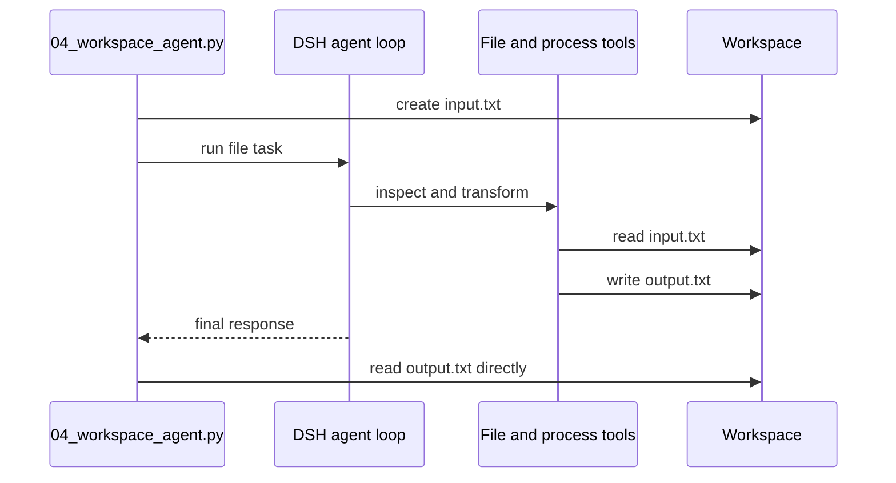

# 教程 04：在 workspace 中运行工具

[English](04-workspace-agent.md) | 中文

## 结果

使用 [`04_workspace_agent.py`](../04_workspace_agent.py)交给 agent 一个真实文件任务。直接验证结果文件，而不是相信模型对自身工作的描述。

## 前置要求

完成[教程 03](03-stream-events.zh.md)。请使用可丢弃目录，因为内置 agent 配置可以用运行时进程的权限暴露本地文件系统和子进程工具。

## 运行

```sh
uv run --project python-sdk python python-sdk/04_workspace_agent.py \
  --workspace /tmp/dsh-demo-04
```

脚本会创建 `input.txt`，要求 agent 把排序结果写入 `output.txt`，然后自行读取 `output.txt`。

## 工作原理

`cwd` 选择 agent workspace，`session_root` 把日志保存在它旁边。模型会看到内置 Cordis 组装注册的工具，选择必要的调用，并可能在轮次结束前执行多个模型步骤。Python 调用方仍然负责在运行之后检查外部状态。



[`DeepSeekHarness.__init__`](https://github.com/deepseek-ai/deepseek-harness/blob/master/python/sdk/src/deepseek_harness/api.py)负责构造 `cwd` 和环境映射。实际工具集属于运行时 Cordis 配置，而不属于 Python SDK。

## 验证

确认 `output.txt` 存在，并依次包含 `blue`、`green` 和 `red`。文件内容是比 assistant 回复更强的证据。检查 `.dsh-sessions` 中的持久工具调用与工具结果事件。

## 限制

默认示例组装不是安全沙箱。`cwd` 为 agent 提供工作目录，但自身不能阻止绝对路径访问。生产代码应把隔离 checkout 或容器与显式 DSH 沙箱策略组合使用。继续阅读[教程 05](05-low-level-client.zh.md)检查协议生命周期。
