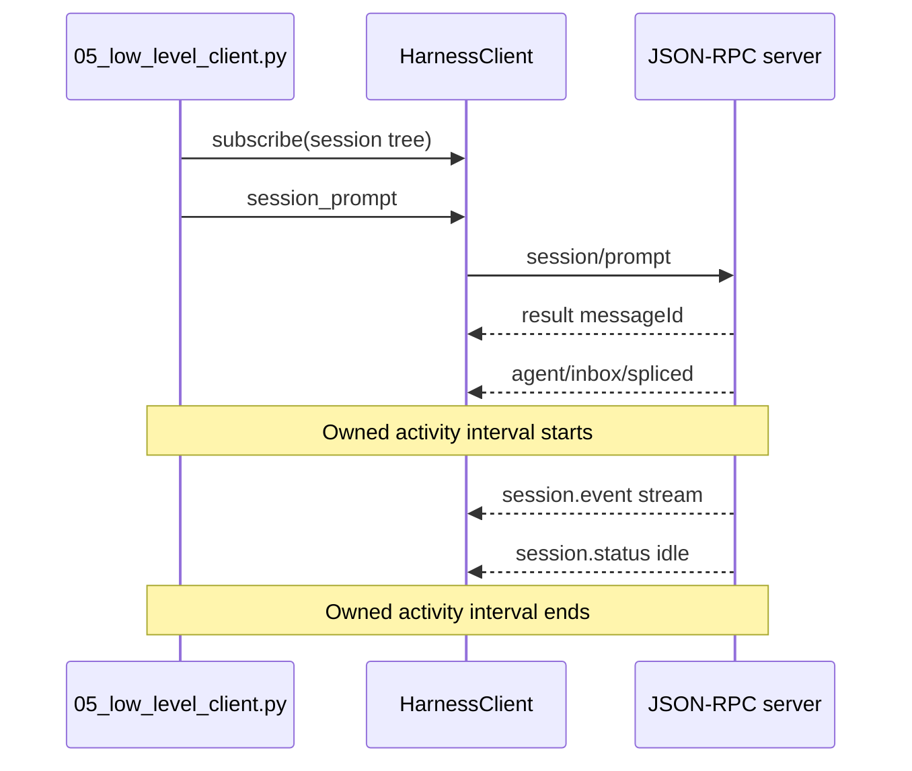

# Tutorial 05: Drive `HarnessClient`

English | [中文](05-low-level-client.zh.md)

## Outcome

Use [`05_low_level_client.py`](../05_low_level_client.py) to perform the lifecycle hidden by `Session.run()`: initialize the runtime, subscribe before enqueueing, capture the `messageId`, correlate its durable inbox receipt, stream root text, and settle at idle.

## Prerequisites

Complete [Tutorial 04](04-workspace-agent.md). This tutorial assumes you understand that a JSON-RPC response and an agent result are different events.

## Run it

```sh
python python-sdk/05_low_level_client.py \
  --session-id python-demo-05 \
  --session-root /tmp/dsh-demo-05 \
  "Reply with exactly: PYTHON_DEMO_05_OK"
```

The output includes streamed text, server metadata, the accepted message ID, and the number of observed session events.

## How it works

The subscription is created before `session_prompt()` so a fast runtime cannot emit a relevant event before the listener exists. `session_prompt()` returns after enqueueing, not after model completion. `inbox_contains_message()` establishes the lower bound of the owned activity interval; the next root `session.status=idle` establishes its upper bound.



The public methods are in [`HarnessClient`](https://github.com/deepseek-ai/deepseek-harness/blob/master/python/sdk/src/deepseek_harness/client.py). The high-level implementation in [`Session.run()`](https://github.com/deepseek-ai/deepseek-harness/blob/master/python/sdk/src/deepseek_harness/api.py) applies the same receipt-to-idle rule and then derives `final_response` and `finish_reason`.

## Verify it

Confirm the server identifies itself, `message_id` is non-empty, text arrives before the final counters, and the process exits cleanly. The event count varies by model behavior and configuration; do not assert an exact value in business code.

## Limitations

Low-level access exposes transport mechanics but does not add server capabilities. There is no prompt-specific completion result, cancel method, session catalog, approval response, or queue control in the current SDK JSON-RPC method set. Continue with [Tutorial 06](06-raw-jsonrpc.md) to see what the SDK client saves you from implementing.
