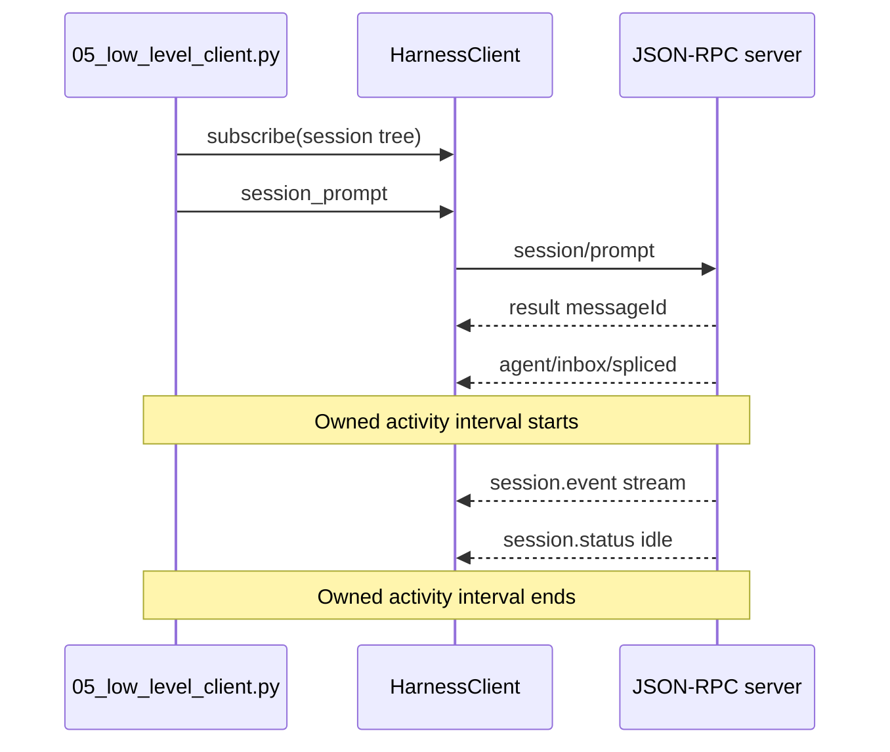

# 教程 05：驱动 `HarnessClient`

[English](05-low-level-client.md) | 中文

## 结果

使用 [`05_low_level_client.py`](../05_low_level_client.py)执行 `Session.run()` 隐藏的生命周期：初始化运行时、在入队前订阅、获取 `messageId`、关联其持久 inbox 回执、流式输出根会话文本，并在空闲状态完成结算。

## 前置要求

完成[教程 04](04-workspace-agent.zh.md)。本教程假设你已经理解 JSON-RPC 响应和 agent 结果是不同事件。

## 运行

```sh
uv run --project python-sdk python python-sdk/05_low_level_client.py \
  --session-id python-demo-05 \
  --session-root /tmp/dsh-demo-05 \
  "Reply with exactly: PYTHON_DEMO_05_OK"
```

输出包含流式文本、服务器元数据、已接受的消息 ID 和观察到的会话事件数量。

## 工作原理

系统在 `session_prompt()` 之前创建订阅，防止快速运行时在监听器存在之前发出相关事件。`session_prompt()` 在消息入队后返回，而不是在模型完成后返回。`inbox_contains_message()` 建立所拥有活动区间的下界；下一条根会话 `session.status=idle` 建立其上界。



公开方法位于 [`HarnessClient`](https://github.com/deepseek-ai/deepseek-harness/blob/master/python/sdk/src/deepseek_harness/client.py)。[`Session.run()`](https://github.com/deepseek-ai/deepseek-harness/blob/master/python/sdk/src/deepseek_harness/api.py)的高层实现使用相同的回执到空闲规则，再派生 `final_response` 与 `finish_reason`。

## 验证

确认服务器能标识自身、`message_id` 非空、文本先于最终计数器到达，而且进程干净退出。事件数量随模型行为和配置而变化；业务代码不应断言精确值。

## 限制

低层访问会暴露传输机制，但不会增加服务器能力。当前 SDK JSON-RPC 方法集中没有提示词专属完成结果、取消方法、会话目录、批准响应或队列控制。继续阅读[教程 06](06-raw-jsonrpc.zh.md)，了解 SDK 客户端替你省掉了哪些实现。
