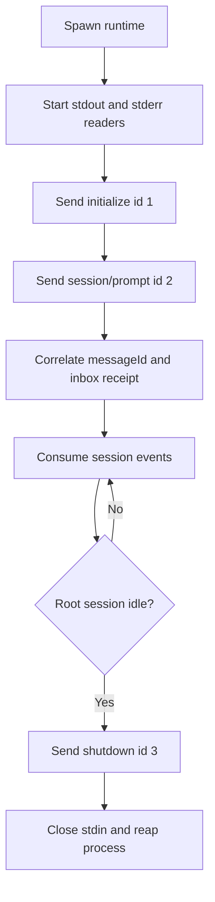

# Tutorial 06: Hand-write stdio JSON-RPC

English | [中文](06-raw-jsonrpc.zh.md)

## Outcome

Use [`06_raw_jsonrpc.py`](../06_raw_jsonrpc.py) to launch the bundled runtime without `DeepSeekHarness` or `HarnessClient`. This is a protocol probe and SDK-authoring example, not the recommended application integration.

## Prerequisites

Complete [Tutorial 05](05-low-level-client.md). The installed `deepseek-harness-runtime-bin` package must contain a runtime for the current platform.

## Run it

```sh
python python-sdk/06_raw_jsonrpc.py \
  --session-id python-demo-06 \
  --session-root /tmp/dsh-demo-06 \
  "Reply with exactly: PYTHON_DEMO_06_OK"
```

The script prints the initialize result, prompt message ID, live text, and exits after a successful shutdown response.

## How it works

The script resolves the runtime carrier and default Cordis config from `deepseek_harness_runtime`, spawns the process with piped stdio, drains stdout and stderr concurrently, encodes one compact JSON-RPC object per line, correlates responses by ID, consumes notifications, and enforces the same durable-receipt-to-idle interval as the SDK.



Compare this file with [`client.py`](https://github.com/deepseek-ai/deepseek-harness/blob/master/python/sdk/src/deepseek_harness/client.py): the SDK additionally owns concurrent request waiters, filtered subscriptions, descendant discovery, diagnostics, timeout behavior, transport closure errors, and reusable lifecycle management.

## Verify it

Confirm all three response IDs complete, streamed text is present, and no runtime process remains after exit. A failure should include recent stderr diagnostics without revealing credentials.

## Limitations

Raw transport bypasses client validation and duplicates difficult lifecycle code. It cannot invoke methods absent from the server. Use it for diagnostics, conformance tests, or implementing a new language SDK; use `DeepSeekHarness` or `HarnessClient` in ordinary business code. The next learning layer is the FastAPI demo, which turns SDK notifications into browser-safe SSE events.
