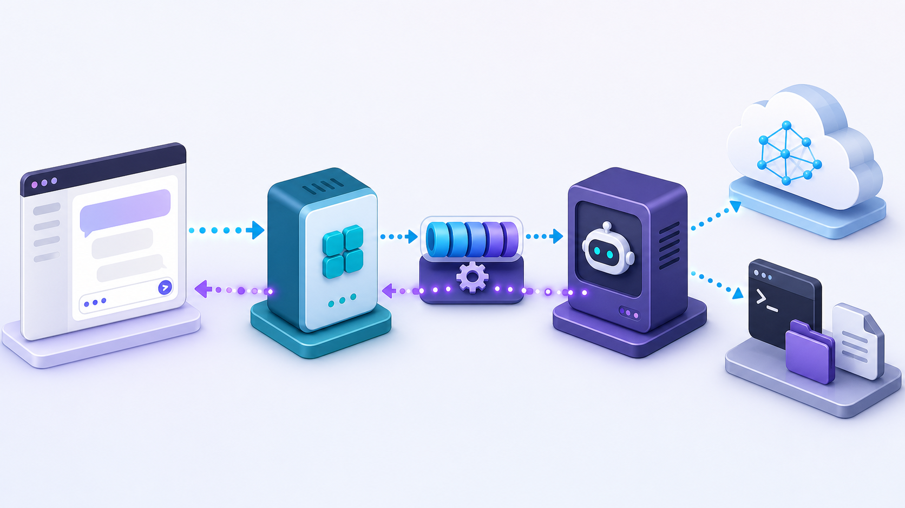
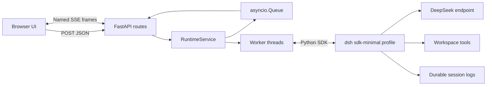

# DSH FastAPI 101：从零构建 Web Agent

> 已验收版本（2026-09-29）：PyPI `deepseek-harness-sdk==0.1.5rc1` 与匹配的 `deepseek-harness-runtime-bin==0.1.5rc1`；对应上游 [`dsh-v0.1.5-rc.1`](https://github.com/deepseek-ai/deepseek-harness/tree/183f08e9c6dde7e36cd2318eaee70b0da08fb35e)。

这是一套独立于 DeepSeek Harness 原仓文档的中文入门教程。“101”表示从零开始的基础课程，不是案例编号。项目用 FastAPI、原生 HTML/CSS/JavaScript 和已发布的 `deepseek-harness-sdk`，演示如何把 DSH 作为本地 agent runtime 嵌入自己的 Web 业务。



生成图用于建立直觉，下面的 Mermaid 和源码才是精确机制。

## 你会构建什么

一个 FastAPI 进程在 lifespan 中拥有一个 DSH runtime 子进程。浏览器可以发送同步请求，也可以通过 POST + SSE 接收已提交的 assistant 消息、工具与生命周期事件；多个业务 session 共享 runtime，但对话历史和同 session 的并发控制相互隔离。


```mermaid
flowchart LR
    Browser[Browser UI] -->|POST JSON| FastAPI[FastAPI routes]
    Browser <-->|Named SSE frames| FastAPI
    FastAPI --> Service[RuntimeService]
    Service --> Queue[asyncio.Queue]
    Service --> Worker[Worker threads]
    Worker <-->|Python SDK| Runtime[dsh sdk-minimal profile]
    Runtime --> Model[DeepSeek endpoint]
    Runtime --> Tools[Workspace tools]
    Runtime --> Logs[Durable session logs]
    Queue --> FastAPI
```

## 学习路径

整套 101 只有一个可运行 demo，教程按五章逐步打开能力：

1. [第一章：FastAPI 阻塞式 API](src/dsh_fastapi_101/static/tutorials/01-blocking-api.md)
2. [第二章：POST + SSE 事件通知](src/dsh_fastapi_101/static/tutorials/02-sse-stream.md)
3. [第三章：浏览器多轮会话](src/dsh_fastapi_101/static/tutorials/03-multi-turn-session.md)
4. [第四章：工具与 Agent 轨迹](src/dsh_fastapi_101/static/tutorials/04-tool-trajectory.md)
5. [第五章：Runtime 生命周期与并发](src/dsh_fastapi_101/static/tutorials/05-runtime-lifecycle.md)

建议按顺序阅读。前端左侧导航对应这五章，每一章都复用同一套后端并突出一个新概念。

## 安装

要求 Python 3.10 或更高版本，以及受 `deepseek-harness-runtime-bin` 支持的平台。推荐使用 uv：

```sh
cd tutorials/fastapi-101
uv sync --group dev
```

设置模型凭据。建议从本地根目录 `.env` 加载；在上面的 `cd tutorials/fastapi-101` 后，`../../.env` 指向该文件。不要把密钥写进源码、`.env` 示例或 Git。如果 shell 已经 `export` 了 `DEEPSEEK_API_KEY`、`DEEPSEEK_BASE_URL` 和 `DSH_MODEL`，启动命令可省略 `--env-file ../../.env`；本 README 不应写入真实值。

项目精确锁定 SDK `0.1.5rc1`。安装 SDK 会自动安装完全匹配的 runtime wheel，目标机器不需要 Node.js。

## 启动

```sh
uv run --env-file ../../.env python -m dsh_fastapi_101
```

打开：

- `http://127.0.0.1:8000/chapter/1`：教程前端
- `http://127.0.0.1:8000/docs`：FastAPI OpenAPI UI
- `http://127.0.0.1:8000/api/health`：runtime 健康状态

服务默认只监听 loopback。不要在没有认证、租户隔离、CSRF/Origin 策略和 workspace 沙箱时绑定到公网地址。

## API

| 方法 | 路径 | 用途 |
|---|---|---|
| `GET` | `/api/health` | 检查 FastAPI lifespan 是否已启动 runtime |
| `POST` | `/api/chat` | 等待一次活动区间完成并返回 JSON |
| `POST` | `/api/chat/stream` | 在一个 POST 响应中返回命名 SSE 事件 |
| `GET` | `/api/sessions` | 列出当前服务进程接纳过的 session ID |

`/api/chat` 和 `/api/chat/stream` 都接收：

```json
{
  "session_id": "my-conversation",
  "prompt": "请检查 workspace 并回答问题"
}
```

## 浏览器事件

`src/dsh_fastapi_101/events.py` 不把完整 DSH 事件原样透传，而是投影成应用拥有的词汇：

- `assistant_message`：根会话已提交文本，替换当前回答，不代表逐 token 流
- `status`
- `lifecycle`
- `tool_call`
- `tool_result`
- `subagent_started`
- `subagent_finished`
- `final`
- `error`

模型推理内容、完整请求头和未知插件事件不会进入浏览器流。原始事实仍保留在 DSH 持久会话日志中。

`/api/chat` 在模型以 `error`、`max-tokens` 等非 `completed` 状态结束时返回 HTTP 502 和 `error.finish_reason`。SSE 在响应开始后用 `error` 帧结束，不发送成功 `final`。浏览器收到 `assistant_message` 时替换主回答，收到 `final` 时再用权威最终回复替换；工具与状态事件继续按事件显示。

## 源码地图

| 文件 | 职责 |
|---|---|
| `src/dsh_fastapi_101/app.py` | FastAPI lifespan、JSON/SSE 路由和静态前端 |
| `src/dsh_fastapi_101/runtime.py` | runtime 进程所有权、线程桥、session 锁与关闭结算 |
| `src/dsh_fastapi_101/events.py` | DSH Notification 到 BrowserEvent 的安全投影 |
| `src/dsh_fastapi_101/models.py` | 应用自己的 HTTP 请求与结果模型 |
| `src/dsh_fastapi_101/static/` | 无构建步骤的浏览器 UI 与五章教程 |
| `tests/` | API、事件、并发、生命周期和教程完整性测试 |

## 配置

| 环境变量 | 默认值 | 作用 |
|---|---|---|
| `DEEPSEEK_API_KEY` | 无 | DeepSeek 模型凭据 |
| `DEEPSEEK_BASE_URL` | SDK 默认 | OpenAI 兼容模型端点 |
| `DSH_MODEL` | `deepseek-v4-flash` | 模型 ID |
| `DSH_PROVIDER` | `deepseek-official` | DSH provider 路由 |
| `DSH_FASTAPI_WORKSPACE` | `workspace` | agent 工作目录 |
| `DSH_FASTAPI_HOME` | `.dsh-fastapi-home` | 独立 Harness home，保存 profile 与会话数据 |

目录只在 lifespan 启动时创建；单纯 import 应用不会修改文件系统。使用 `sdk-minimal` 公共 profile；本次运行的 home 与 workspace 应放在专用的可丢弃目录。关闭期间拒绝新任务，并等待已接纳的 JSON 与 SSE 工作结算；浏览器断连不会取消 DSH 执行。

## 测试

```sh
uv run pytest
uv run ruff check .
uv run ruff format --check .
```

测试使用假的 harness 验证应用语义，不调用模型。Ruff 负责 lint 和格式检查。真实端到端验证需要环境中的 `DEEPSEEK_API_KEY`，然后启动服务并使用 curl 或浏览器发送任务。

## 发行版实跑记录（2026-09-29）

在本教程目录以 `uv run --env-file <本机环境文件> python -c <TestClient 场景>` 运行真实应用 lifespan；`DSH_FASTAPI_HOME` 与 `DSH_FASTAPI_WORKSPACE` 指向本次创建的临时目录。已安装的 SDK 与 runtime wheel 均报告 `0.1.5rc1`，使用 `deepseek-official` / `deepseek-v4-flash`，本次环境没有 `DEEPSEEK_BASE_URL` 覆盖。此版本官方适配器使用 Chat Completions API 与 Session V3。

| 路径 | 观察结果 |
|---|---|
| JSON `/api/chat` | HTTP 200、`finish_reason=completed`，回复包含 `FASTAPI_JSON_OK` |
| 同 session 两轮 JSON | 第二轮回忆 `CERULEAN` |
| POST SSE | 1 条根 `assistant_message` 与唯一 `final.response` 一致，包含 `FASTAPI_SSE_OK` |
| SSE 工具任务 | 1 个 `tool_call`、1 个 `tool_result`；脚本在模型响应之外确认 `output.txt` 等于输入的精确 15 字节 `b"alpha\nBETA\nend\n"` |

应用 lifespan 关闭后，外部 `ps` 父子进程检查发现本次运行中出现的 6 个后代 PID 均已退出。以上是一次真实模型运行；失败终态、并发和取消等待由 27 个 keyless pytest 测试覆盖。页面的桌面、窄屏与可访问性验收另见统一迁移记录。

## 生产化前必须补齐

- 身份认证、租户授权与 session 所有权校验
- 业务数据库中的 Conversation、Run、Artifact 与事件序号
- workspace 容器或 DSH sandbox 隔离
- 工具结果截断、敏感字段清理与审计
- SSE 心跳、断线重放、背压和多消费者 fan-out
- runtime supervisor、资源配额与多进程部署策略
- 服务器协议支持后的 cancel、approval、ask-user 与 session 管理

当前 SDK JSON-RPC 是“详细观察、有限控制”。手写 JSON-RPC 不会凭空增加服务器没有的方法；业务扩展应优先补服务器语义，再由 Python SDK 封装。

## 插图说明

`assets/dsh-fastapi-architecture.png` 由内置 image generation 工具生成，最终提示词要求一个无文字、16:9、紫色与青色的开发者架构插图，依次表现浏览器、Web 服务、异步队列/工作线程、agent runtime、模型云与本地工具，并用反向粒子流表示流式事件。它不包含协议字段，避免与源码发生语义漂移。
