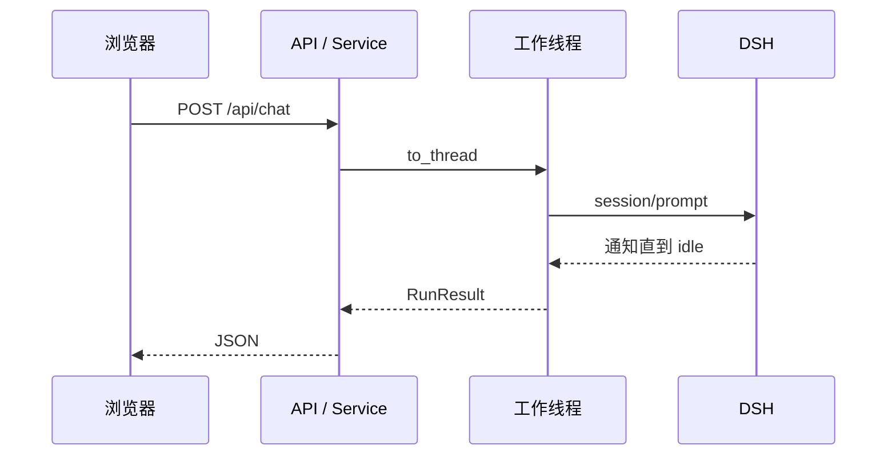

# 第一章：FastAPI 阻塞式 API

## 学习目标

先做一个最朴素的 Web Agent：浏览器发一句话，服务等 Agent 忙完，再一次返回答案。这里“阻塞式”说的是客户端要等待整份响应；服务端仍然可以处理别的请求。我们先跑通这条路径，再看一个 HTTP 请求如何交给 `RuntimeService.run()`，以及它为什么要等到 DSH 的整个活动区间结束。

## 前置条件

先在 `tutorials/fastapi-101` 目录完成 `uv sync --group dev`，并在仓库根 `.env` 中设置 `DEEPSEEK_API_KEY`，或把它导出到 shell。服务只监听 `127.0.0.1`，workspace 与 Harness home 默认分别写入当前项目的 `workspace/` 和 `.dsh-fastapi-home/`。

## 运行

在克隆仓库的 `tutorials/fastapi-101` 目录执行。命令用 Git 定位仓库根目录，再加载其中的本地 `.env`。若服务已在运行，沿用同一个进程即可，不必每章重启；若凭据已由 shell 导出，可省略 env-file 参数。

```sh
uv run --env-file "$(git rev-parse --show-toplevel)/.env" python -m dsh_fastapi_101
```

打开 `http://127.0.0.1:8000/chapter/1`，或者直接调用 API：

```sh
curl -s http://127.0.0.1:8000/api/chat \
  -H 'content-type: application/json' \
  -d '{"session_id":"chapter-1","prompt":"只回复：CHAPTER_1_OK"}'
```

模型按要求回答且运行完成时，响应形如下面这样。它是输出示意，实际措辞由模型决定：

```json
{"session_id":"chapter-1","response":"CHAPTER_1_OK","finish_reason":"completed"}
```

`session_id` 是业务传入的对话标识，第二次请求可以继续使用它；它不是这一次 HTTP 请求的 ID。`finish_reason` 说明 Agent 如何结束，`response` 才是最终提交的文本。先把这三个字段分开理解，下一章再观察答案形成之前的事件。

## 源码分析

打开 `src/dsh_fastapi_101/app.py`，从 `/api/chat` 路由往下读：请求先被解析为 `ChatRequest`，再交给 `RuntimeService.run()`。切到 `runtime.py` 的 `_execute()`，最关键的一行是 `await asyncio.to_thread(session.run, ...)`。

Python SDK 的 `Session.run()` 是同步调用，会等提示词进入持久 inbox，再等整个 Agent 回到 `idle`。把它交给工作线程，ASGI 的事件循环就能继续处理健康检查等请求；`await` 只让当前请求等待结果。



为什么不直接在 `async def` 路由里调用 `session.run()`？因为它会持续等待模型、工具和 `idle`，直接调用会冻结当前事件循环线程，使同一 worker 无法及时处理健康检查与其他请求。

## 验证

1. `/api/health` 返回 `runtime_started: true`。
2. `/api/chat` 返回 HTTP 200，`finish_reason` 为 `completed`；`error` 与 `max-tokens` 返回 HTTP 502 JSON 错误。
3. `.dsh-fastapi-home/` 下出现 profile 和持久会话数据。
4. 服务停止后不再残留公开 `dsh` runtime 子进程。

可以做个小实验：一个终端请求较长回答时，在另一个终端访问 `/api/health`。它应仍能及时响应。这个观察解释了工作线程的用途；不要把单次延迟测量当成吞吐量基准。

## 限制

阻塞式接口只有完成后的最终结果，没有增量文本和工具轨迹。HTTP 连接断开不会等价于取消 agent，因为当前 SDK JSON-RPC 没有 `session/cancel`。下一节用 SSE 暴露运行中的事件，但仍保持 agent 在服务端结算。
