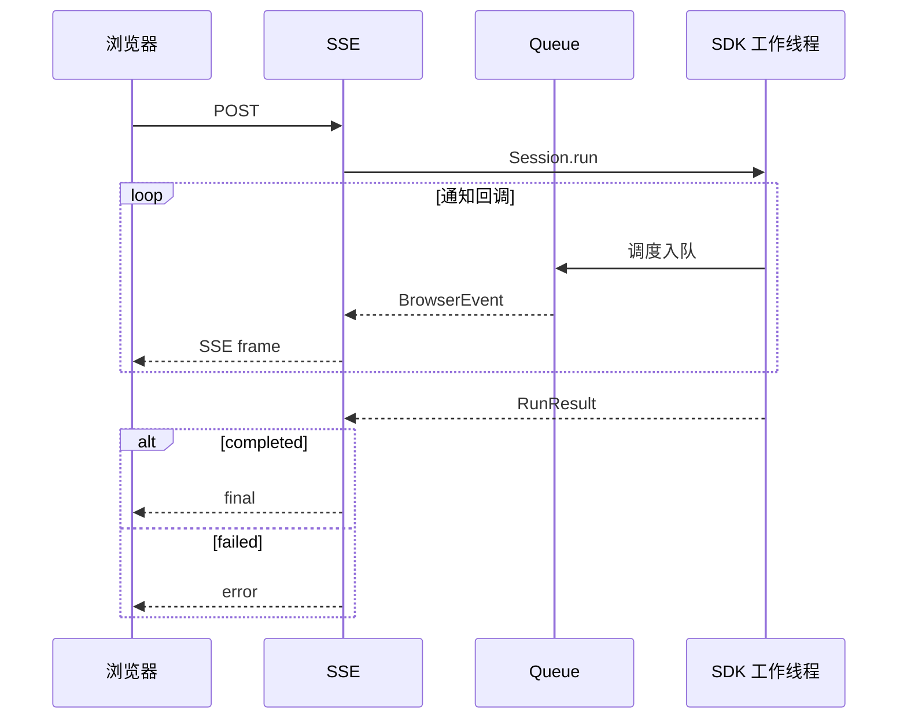

# 第二章：POST + SSE 事件通知

## 学习目标

上一章里，Agent 调工具时，浏览器只能等最终 JSON。现在让同一条 HTTP 响应保持打开：有一条状态、工具或已提交消息事件，就发一帧 SSE。你会看到答案提交与整个活动结束是两个时刻；这里仍然没有逐 token 的打字机效果。

## 前置条件

先完成第一章。SSE 响应依旧由一个 POST 请求创建，因为提示词和 session ID 需要放在 JSON body 中；原生 `EventSource` 只方便发起 GET，因此前端使用 `fetch()` 与 `ReadableStream` 解析标准 SSE 帧。

## 运行

在克隆仓库的 `tutorials/fastapi-101` 目录执行。命令用 Git 定位仓库根目录，再加载其中的本地 `.env`。若服务已在运行，沿用同一个进程即可，不必每章重启；若凭据已由 shell 导出，可省略 env-file 参数。

```sh
uv run --env-file "$(git rev-parse --show-toplevel)/.env" python -m dsh_fastapi_101
```

打开 `http://127.0.0.1:8000/chapter/2`。也可以用 curl 关闭客户端缓冲：

```sh
curl -N http://127.0.0.1:8000/api/chat/stream \
  -H 'content-type: application/json' \
  -d '{"session_id":"chapter-2","prompt":"分三行解释 agent runtime。"}'
```

每帧都有 `event:` 名称和一行 JSON `data:`，帧之间用空行分隔。下面省略模型实际文本，展示一条已提交消息的编码：

```text
event: assistant_message
data: {"type":"assistant_message","session_id":"chapter-2","data":{"text":"..."}}

```

最后一帧是 `final` 或 `error`。`assistant_message` 表示消息已提交；`final` 才告诉浏览器本次调用已成功结算。两者都带文本时，应替换当前回答，不能重复拼接。

## 源码分析

从 `RuntimeService.stream()` 的 `queue` 和 `on_notification()` 两处读起。同步的 `Session.run()` 在工作线程中执行，SSE 生成器却由事件循环消费。回调不能直接把数据塞进另一个线程拥有的 asyncio 队列，所以使用 `loop.call_soon_threadsafe()` 把入队动作交回事件循环。

在入队之前，`events.py` 已经把 DSH 通知转换成应用自己的 `BrowserEvent`。例如根 session 的 `assistant/message` 变成 `assistant_message`；模型推理事件不进入这个投影。前端只需理解应用事件，无需认识所有 runtime 插件的事件类型。



Starlette 在迭代生成器之前已经发送 HTTP 200 响应头，所以运行中发生的错误不能改成 HTTP 500。模型以 `error` 或 `max-tokens` 结束时也不能发成功 `final`。本项目用 `event: error` 作为终止帧，让浏览器在同一协议内处理失败。

## 验证

1. curl 输出中先出现 `status`、`lifecycle` 或 `assistant_message`，最后出现 `final`。
2. 浏览器收到 `assistant_message` 时替换当前回答；`final` 再用权威最终回复替换，不重复拼接。
3. 时间线不出现 `reasoning-delta`。
4. `Cache-Control: no-cache` 和 `X-Accel-Buffering: no` 响应头存在。

读代码时再找 `offer()`：队列最多保存 256 条待发事件，满了就丢最早的普通通知，终止事件仍保留。可运行 `uv run pytest -k sse_queue_saturation` 看无模型测试如何把队列填满。这验证的是应用背压选择，不是模型输出顺序。

## 限制

这是单订阅、单 HTTP 连接的教学实现，没有断线重放、事件序号、心跳或多消费者 fan-out。队列满时丢弃最早的普通通知，终止 `final` / `error` 事件保留；它不保证展示每个中间事件。生产服务应为业务 Run 保存单调序号与有限事件缓存，并让重连客户端从确认位置恢复。
