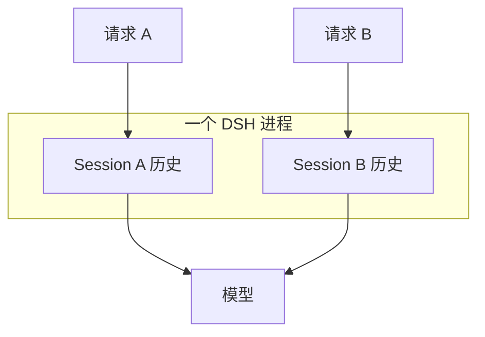

# 第三章：浏览器多轮会话

## 学习目标

让 Agent 记住一个代号，再发一条不带答案的问题。如果第二轮还能答出代号，我们就有了检查会话连续性的具体办法。这一章同时区分两个容易混在一起的动作：复用 runtime 省去启动成本，复用 session 才决定模型能否看到前文。

## 前置条件

先完成第二章。在浏览器中点击“记住代号”，运行完成后保持 session ID 不变，再点击“召回代号”。点击“新建 session”会生成另一条独立对话。

## 运行

在克隆仓库的 `tutorials/fastapi-101` 目录执行。命令用 Git 定位仓库根目录，再加载其中的本地 `.env`。若服务已在运行，沿用同一个进程即可，不必每章重启；若凭据已由 shell 导出，可省略 env-file 参数。

```sh
uv run --env-file "$(git rev-parse --show-toplevel)/.env" python -m dsh_fastapi_101
```

打开 `http://127.0.0.1:8000/chapter/3`，按以下顺序运行：

1. `记住项目代号 ORBIT，只回复：已记录`
2. `项目代号是什么？只回复代号。`

第二轮应回复 `ORBIT`。随后新建 session 并直接询问代号，新会话不应继承旧会话内容。

## 源码分析

先在 `RuntimeService.start()` 找到 `DeepSeekHarness` 的构造，再在 `_execute()` 找 `start_session(session_id)`。前者在整个 FastAPI lifespan 中只有一个，因此这些请求共用 runtime 进程；后者按 ID 选择当前进程中的会话句柄。复用同一个句柄对应的历史，第二轮才有机会看到代号。

这里直接把浏览器传入的 ID 用作 DSH session ID，是方便观察的一对一映射。它不代表生产系统必须让业务 Conversation ID 与 runtime ID 相同，更不代表页面刷新或进程重启后所有状态都自动恢复。



`RuntimeService._sessions` 只是本进程已经接纳过哪些 ID 的应用内目录，用于演示 `/api/sessions`。它不是 DSH 持久会话的权威目录；服务重启后集合会清空，但所选 `DSH_FASTAPI_HOME` 中的事件日志仍可存在。

## 验证

1. 同一 ID 的第二轮能回复 `ORBIT`。
2. `/api/sessions` 包含使用过的 ID。
3. 新 ID 不共享前一个会话的语境。
4. 多个 ID 仍只对应一个 runtime 子进程。

把代号换成自己刚生成的随机字符串，会比固定的 `ORBIT` 更容易排除模型猜中的情况。第二轮不要把代号写进问题；新会话对照也一样。验证的是它能否使用前文，不是能否复制当前输入。

## 限制

当前 SDK JSON-RPC 不提供 session list/read/delete/fork API，因此本教程没有实现完整会话管理后台。生产业务应在自己的数据库中保存用户、Conversation、Run 与 DSH session ID 的映射，把 DSH 日志视为 runtime 状态，不把它当作业务唯一真源。
