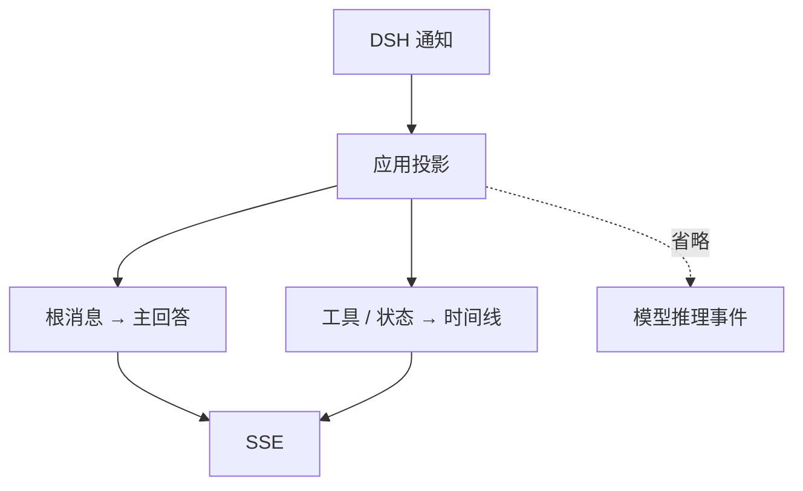

# 第四章：工具与 Agent 轨迹

## 学习目标

这一章让 Agent 真正调用一次工具。我们既要看到它发出了什么请求，也要看到工具返回了什么；最终回答留在主区域，执行过程放在时间线。一次简单的 `printf` 就足够把这三种内容分开，不需要先做复杂任务。

## 前置条件

先完成前三章，理解 `session.event` 与 `session.status` 的区别。内置 runtime 可以执行文件和进程工具，请继续只在本地隔离 workspace 中体验。

## 运行

在克隆仓库的 `tutorials/fastapi-101` 目录执行。命令用 Git 定位仓库根目录，再加载其中的本地 `.env`。若服务已在运行，沿用同一个进程即可，不必每章重启；若凭据已由 shell 导出，可省略 env-file 参数。

```sh
uv run --env-file "$(git rev-parse --show-toplevel)/.env" python -m dsh_fastapi_101
```

打开 `http://127.0.0.1:8000/chapter/4`，使用预设“调用工具”，或者发送：

```text
使用 bash 执行 printf 'TOOL_EVENT_OK\n'，然后只回复它的输出。
```

任务按要求执行时，时间线中应出现 `tool_call` 与 `tool_result`，随后提交最终回答并发出 `final`。状态和 turn/step 生命周期事件穿插其间；实际模型步骤与事件数量可能变化，不要把一张固定事件清单当作所有任务的顺序保证。

## 源码分析

打开 `src/dsh_fastapi_101/events.py`，把一次调用和结果放在一起看。`tool/call.data.arguments` 是 JSON 字符串，投影层尝试解析后给浏览器展示；`tool/result` 则提取结果文本和错误标记。两个事件靠同一个 `call_id` 连起来，不靠它们在列表里恰好相邻。

| DSH V3 原始字段 | BrowserEvent 字段 | 界面用途 |
| --- | --- | --- |
| `tool/call.data.callId`、`name`、`arguments` | `tool_call.data.call_id`、`name`、`arguments` | 标识工具和这次参数 |
| `tool/result.data.message.source.callId` | `tool_result.data.call_id` | 关联调用 |
| `message.content` 内 `tool-result` 块的 `content`、`isError` | `tool_result.data.text`、`is_error` | 展示工具输出和失败状态 |

这张表针对本教程锁定的 V3 runtime。不要把后面 TypeScript/V4 项目的字段位置直接搬过来。



为什么不直接把完整 `session.event` 原样发给浏览器？因为 runtime 事件集合会随插件扩展，而且包含模型推理、请求头和大量内部细节。业务前端应消费自己版本化的展示事件，后端保留原始 DSH 日志用于诊断与审计。

subagent 的根文本和子文本必须分开。SDK 回调可能收到整个已知后代树的通知，本项目只把根 session 的 `assistant/message` 文本替换为主回复，子 session 通过 `subagent_started`、`subagent_finished` 和各自的工具/生命周期事件显示。

## 验证

1. 时间线包含一对具有相同 `call_id` 的 `tool_call` 与 `tool_result`。
2. 工具结果显示 `TOOL_EVENT_OK`，且 `is_error` 为 `false`。
3. 主响应只包含最终 assistant 文本，不混入工具 stdout 或 subagent 文本。
4. 这个固定 `printf` 例子的浏览器事件中不出现 `reasoning-delta` 或完整模型请求头。投影会转发工具参数与输出，不能由此推断任意工具输出都已脱敏。

再读一下 `_tool_result()`：为什么结果要从 `tool-result` 内容块中提取，而不能把整个原始事件直接显示？可以运行 `uv run pytest tests/test_events.py`，对照 root/child 文本、工具与 subagent 的几种输入。

## 限制

本项目的 BrowserEvent 还没有 schema 版本、持久序号、断线重放与结果截断策略。生产系统需要限制工具结果大小、清理敏感字段，并把原始事件和面向用户的投影分开存储。当前 SDK 也不提供批准响应与 ask-user 响应流程，因此时间线只能观察这些相关持久事实，不能完成完整交互闭环。
