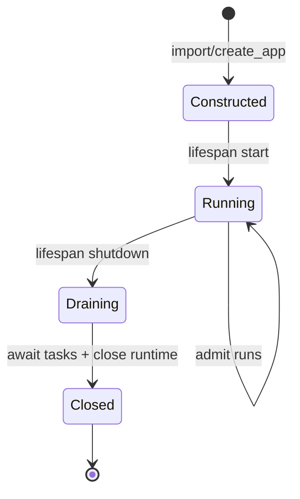
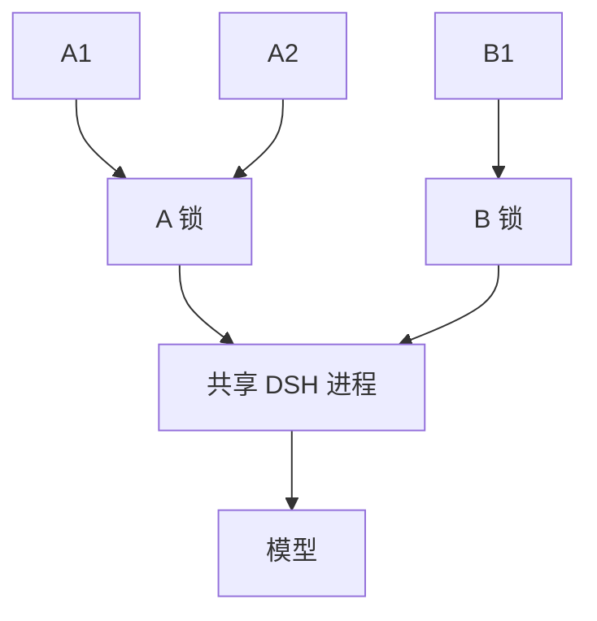

# 第五章：Runtime 生命周期与并发

## 学习目标

浏览器刷新了，Agent 的工具却可能还在工作。服务应该等它完成，还是直接退出？这一章从这个问题出发，把 runtime 的主人找出来：FastAPI lifespan 负责启动与关闭，已接纳的任务由服务追踪，浏览器只负责等待和显示。

## 前置条件

先完成前四章。第五章关注服务端资源语义，不增加新的 UI 控件。建议同时打开两个浏览器标签或使用两个 curl 进程观察不同 session。

## 运行

在克隆仓库的 `tutorials/fastapi-101` 目录执行。命令用 Git 定位仓库根目录，再加载其中的本地 `.env`。若服务已在运行，沿用同一个进程即可，不必每章重启；若凭据已由 shell 导出，可省略 env-file 参数。

```sh
uv run --env-file "$(git rev-parse --show-toplevel)/.env" python -m dsh_fastapi_101
```

打开 `http://127.0.0.1:8000/chapter/5`。用两个不同 session ID 同时发送较长任务，随后再用同一个 ID 快速连续发送两次请求。

## 源码分析

先沿 `start()` 看一次正常启动：在接收流量前创建 workspace 和 Harness home，构造 `DeepSeekHarness`，完成 runtime 初始化。仅 import `app` 不会做这些动作；即使初始化失败，已经创建的 SDK owner 也要关闭。

再沿 `close()` 看退出：先停止接纳新任务，然后等待已接纳的 JSON 与 SSE 工作，最后关闭 runtime 并回收进程。顺序很重要：若先关 runtime，线程里的 `Session.run()` 还在等待，结果与副作用就很难解释。



`RuntimeService` 为每个 session ID 创建一个 `asyncio.Lock`。相同 session 的两个 prompt 必须串行，否则两个 `Session.run()` 会争用同一个 agent 活动区间，最终结果无法建立清晰边界；不同 session 使用不同锁，可以在线程池中并发，但仍共享一个 runtime 子进程。



回到浏览器刷新这个问题：SSE 响应生成器停止消费队列后，后台 task 仍留在 `_tasks` 集合中，继续等 DSH `idle`。JSON 请求断连后，已接纳的执行也一样被追踪。断开的是客户端等待，不是 Agent 的执行。

因此，关闭服务时需要等这些任务，而不能只看“现在还有几个HTTP连接”。可以在 `_track()` 中找到登记与完成移除，再到 `_drain_and_close()` 中看关闭如何等待它们。第五章没有增加 UI 按钮；要学的是同一个按钮背后的资源所有权。

## 验证

1. `RuntimeService()` 构造后目录不存在，`start()` 后才出现。
2. 两个不同 session 的测试运行可以重叠；相同 session 的最大并发为 1。关闭开始后新 JSON/SSE 请求被拒绝。
3. FastAPI lifespan 结束后 `DeepSeekHarness.close()` 已执行。
4. 中断 SSE 客户端后，服务仍能在该 session 进入 idle 后接受下一轮。
5. 进程退出时没有残留 runtime 子进程。

无需模型也能检查最重要的并发规则：运行 `uv run pytest -k "serializes_same_session or close_waits"`。测试用可控的等待点证明同 session 串行、不同 session 可重叠，以及 shutdown 等待已接纳任务。真实浏览器实验负责观察体验，两者提供不同的证据。

## 限制

这是单 FastAPI 进程的 runtime 管理器。多 worker 部署会让每个 worker 各自拉起一个 runtime，并且内存锁无法跨进程协调。生产架构应明确采用单 worker、本机 runtime supervisor，或将 runtime 封装为独立服务。当前 JSON-RPC 没有 cancel、steer、inject 和 session 管理方法；在服务器协议扩展前，不应靠杀整个 runtime 来模拟单 session 取消。
