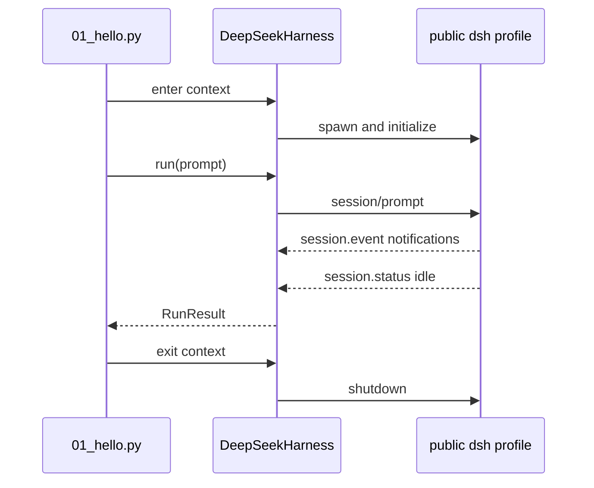

# Tutorial 01: One high-level run

English | [中文](01-hello.zh.md)

## Outcome

Start by handing one sentence from Python to DSH and getting an answer back. After running [`01_hello.py`](../01_hello.py), inspect three things: the conversation ID, the finish reason, and the final text. The context manager has another useful job: when the block ends, it closes the runtime process it started.

## Prerequisites

Complete the installation in the [demo index](../README.md). The command reads the API credential from the environment and stores profile and session data in its selected `--dsh-home`.

## Run it

Run the command from `tutorials/python-sdk`; `../../.env` is the local credential file at the repository root. If the credential is already exported in your shell, omit env-file; for example, `uv run python 01_hello.py` uses the script’s default arguments.

```sh
uv run --env-file ../../.env python 01_hello.py \
  --dsh-home /tmp/dsh-demo-01 \
  "Reply with exactly: PYTHON_DEMO_01_OK"
```

A successful output has this form. The ID is generated each time, and you must check whether the model followed the wording request; this is an illustrative output, not a new recorded run:

```text
session_id: session-<generated-id>
finish_reason: completed
response:
PYTHON_DEMO_01_OK
```

Check `finish_reason` before reading the answer. A function returning does not by itself mean success: the model can also stop because of an error or a token limit. The script rejects a result other than `completed`; compare the response text with your input separately.

## How it works

Open the script and find `result = harness.run(args.prompt)`. That is the business call; the surrounding code selects a workspace, home, and profile and closes resources reliably. `cwd` selects where the agent works, while `dsh_home` holds configuration and session data. They have different jobs.

Entering the `DeepSeekHarness` context resolves the bundled runtime, starts it, and sends `initialize`. `run()` generates a conversation ID, puts the input in the inbox, and waits for the whole agent to reach `idle`. We call the period from the durable input receipt to that idle notification the “activity interval.” `final_response` comes from the final committed assistant message within it. Tutorial 05 opens up that waiting process.



The high-level lifecycle is implemented by [`DeepSeekHarness`](https://github.com/deepseek-ai/deepseek-harness/blob/183f08e9c6dde7e36cd2318eaee70b0da08fb35e/python/sdk/src/deepseek_harness/api.py) and the subprocess transport by [`HarnessClient`](https://github.com/deepseek-ai/deepseek-harness/blob/183f08e9c6dde7e36cd2318eaee70b0da08fb35e/python/sdk/src/deepseek_harness/client.py).

## Verify it

Confirm all three facts: the process exits with status 0, `finish_reason` is `completed`, and the response matches the prompt. The selected home holds the initialized profile and session data; remove it after closing the runtime when no longer needed.

Try once more with a different short marker in the prompt. Check what the answer, finish reason, and new session ID each tell you. Seeing the marker is not a substitute for checking how the run ended.

## Limitations

This example returns only after the owned activity interval reaches `idle`; it does not show incremental events. A final response belongs to that interval rather than carrying strict prompt-to-response causality when other work is queued. Continue with [Tutorial 02](02-reuse-session.md) for session reuse.
