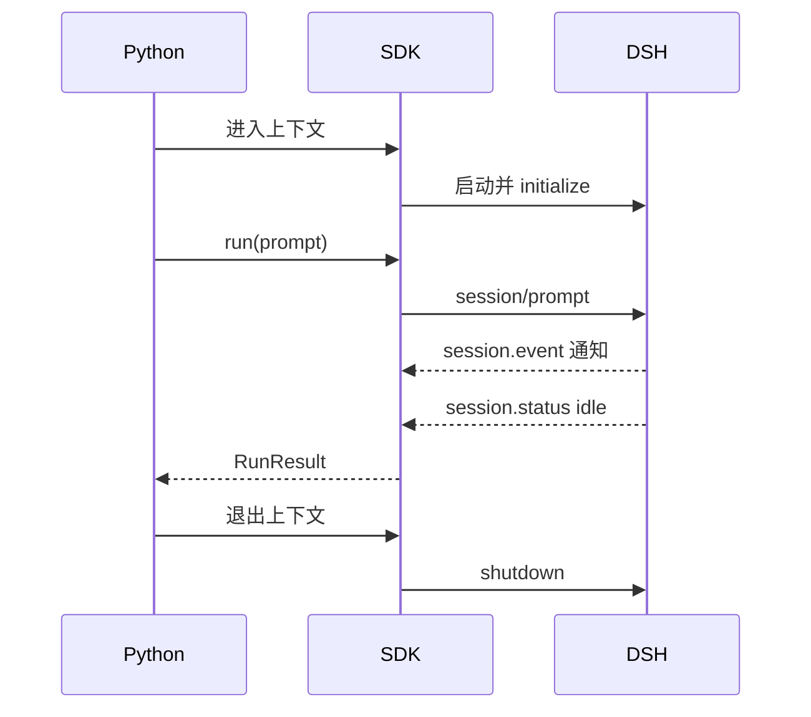

# 教程 01：一次高层运行

[English](01-hello.md) | 中文

## 结果

先让 Python 把一句话交给 DSH，再拿回答复。运行 [`01_hello.py`](../01_hello.py)后，我们看三项输出：这次对话的 ID、结束原因和最终文本。代码里的上下文管理器还有一个容易忽略的作用：离开代码块时，它会关闭自己启动的 runtime 进程。

## 前置要求

完成[示例索引](../README.zh.md)中的安装步骤。命令从环境读取 API 凭据，并把 profile 和会话数据保存在 `--dsh-home` 指定的目录。

## 运行

以下命令从 `tutorials/python-sdk` 目录执行；`../../.env` 是仓库根目录的本地凭据文件。若已在 shell 中导出凭据，可省略 env-file；例如 `uv run python 01_hello.py` 会使用脚本默认参数。

```sh
uv run --env-file ../../.env python 01_hello.py \
  --dsh-home /tmp/dsh-demo-01 \
  "Reply with exactly: PYTHON_DEMO_01_OK"
```

成功时的输出形如下面这样；ID 每次生成，模型是否遵循措辞要求要由你检查，这不是新增的实跑记录：

```text
session_id: session-<generated-id>
finish_reason: completed
response:
PYTHON_DEMO_01_OK
```

先看 `finish_reason`，再看回答。只有函数返回还不够：模型也可能因错误或 token 上限结束。脚本会拒绝非 `completed` 的结果；回复内容则要与这次输入对照。

## 工作原理

打开脚本，先找到 `result = harness.run(args.prompt)`。业务调用只有这一行，周围的代码负责选定 workspace、home 和 profile，并可靠地关闭资源。`cwd` 决定 Agent 在哪里工作，`dsh_home` 保存配置与会话数据；两者职责不同。

进入 `DeepSeekHarness` 上下文时，SDK 解析内置运行时、启动它并发送 `initialize`。`run()` 为本次对话生成 ID，把输入放进 inbox，然后等整个 Agent 回到 `idle`。我们把输入的持久回执到这次空闲之间称为“活动区间”；`final_response` 是从这个区间内已提交的 assistant 消息中取得的最终文本。第五章会拆开这个等待过程。



高层生命周期由 [`DeepSeekHarness`](https://github.com/deepseek-ai/deepseek-harness/blob/183f08e9c6dde7e36cd2318eaee70b0da08fb35e/python/sdk/src/deepseek_harness/api.py)实现，子进程传输由 [`HarnessClient`](https://github.com/deepseek-ai/deepseek-harness/blob/183f08e9c6dde7e36cd2318eaee70b0da08fb35e/python/sdk/src/deepseek_harness/client.py)实现。

## 验证

确认三个事实：进程以状态 0 退出、`finish_reason` 为 `completed`，且回复与提示词匹配。所选 home 保存初始化后的 profile 与会话数据；运行时关闭后不再需要时可删除。

再试一次：只改最后的提示词，要求另一个短标记。检查回答、结束原因和新会话 ID 各自说明什么。不要用“看到标记”替代对结束原因的检查。

## 限制

本示例只有在其拥有的活动区间抵达 `idle` 后才返回，不展示增量事件。当队列中还有其他工作时，最终回复属于该活动区间，不具备严格的提示词到回复因果关系。继续阅读[教程 02](02-reuse-session.zh.md)了解会话复用。
