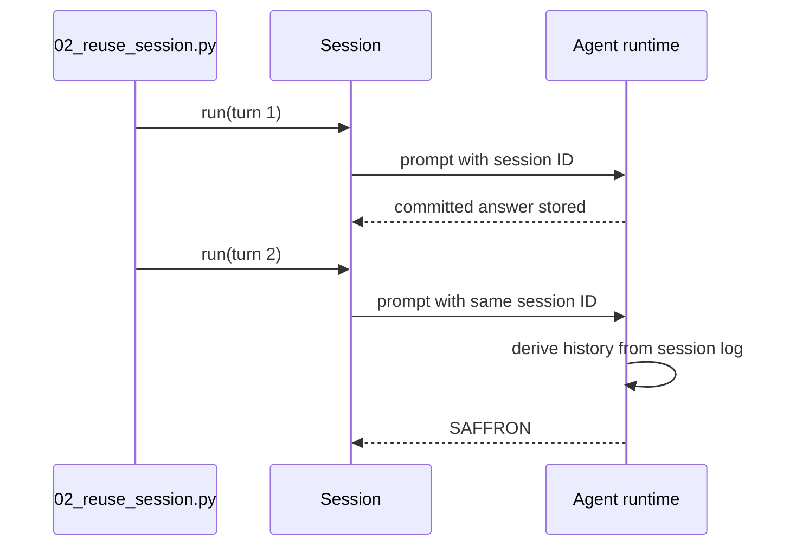

# Tutorial 02: Reuse a runtime and session

English | [中文](02-reuse-session.zh.md)

## Outcome

Run two turns through [`02_reuse_session.py`](../02_reuse_session.py). The second turn recalls data introduced by the first, proving that one `DeepSeekHarness` instance reuses its subprocess and one `Session` keeps conversation state.

## Prerequisites

Complete [Tutorial 01](01-hello.md). Choose a new session ID when repeating this tutorial against the same session root, because a reused ID resumes the durable conversation.

## Run it

```sh
uv run python 02_reuse_session.py \
  --session-id python-demo-02 \
  --session-root /tmp/dsh-demo-02
```

The first turn prints `stored`; the second prints `SAFFRON`.

## How it works

`start_session()` returns a lightweight handle bound to one session ID. Both `Session.run()` calls share the same `HarnessClient`, runtime process, session log, and in-process resources registered for that agent. A different session ID under the same harness would isolate conversation history while still reusing the process.



The reusable instance and session handle live in [`api.py`](https://github.com/deepseek-ai/deepseek-harness/blob/master/python/sdk/src/deepseek_harness/api.py). Session history comes from DSH durable events, not from a Python-side message array.

## Verify it

Check the two exact answers and inspect the session root. Both turns must appear under the same session identity; the runtime closes only after the second turn.

## Limitations

The current SDK does not expose session list, read, fork, delete, or explicit resume methods. Reusing an ID can resume durable history when the configured persistence supports it, but application code must own its session catalog. Continue with [Tutorial 03](03-stream-events.md) for live output.
