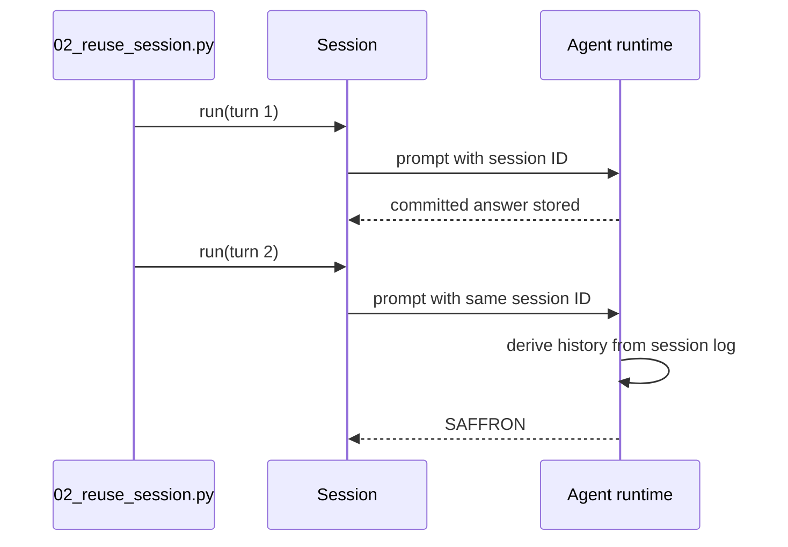

# Tutorial 02: Reuse a runtime and session

English | [中文](02-reuse-session.zh.md)

## Outcome

In the first turn, ask the agent to remember a code word. In the second, ask what that word was without repeating it. The second input therefore tests whether the earlier context is still available. [`02_reuse_session.py`](../02_reuse_session.py) places both calls inside one `DeepSeekHarness` and reuses one `Session`.

## Prerequisites

Complete [Tutorial 01](01-hello.md). Both calls in this chapter happen within one live runtime process. When restarting the script, choose a new `--session-id`. A retained Harness home lets you inspect logs; it does not mean this stock SDK release automatically restores history from the same ID.

## Run it

Run the command from `tutorials/python-sdk`; `../../.env` is the local credential file at the repository root. If the credential is already exported in your shell, omit env-file; for example, `uv run python 02_reuse_session.py` uses the script’s default arguments.

```sh
uv run --env-file ../../.env python 02_reuse_session.py \
  --session-id python-demo-02 \
  --dsh-home /tmp/dsh-demo-02
```

The script requires exactly `stored` for the first answer and `SAFFRON` for the second, with both turns ending as `completed`. Here are the relevant output fields, with the session ID omitted:

```text
turn_1: stored
turn_2: SAFFRON
turn_2_finish_reason: completed
```

An answer such as “The word is SAFFRON” still fails the check. This experiment checks exact recall; finding the word somewhere in a longer answer is not the same assertion.

## How it works

Separate two operations when reading the source: `DeepSeekHarness` owns the runtime process, and `start_session()` returns a lightweight handle bound to a session ID. The two `session.run()` calls share both the process and the conversation history.

Changing the session ID under the same harness still reuses the process but selects a separate conversation. Reusing a process saves startup work; selecting the same session makes prior conversation available. These are different decisions.


```mermaid
sequenceDiagram
    participant App as 02_reuse_session.py
    participant SDK as Session
    participant Runtime as Agent runtime
    App->>SDK: run(turn 1)
    SDK->>Runtime: prompt with session ID
    Runtime-->>SDK: committed answer stored
    App->>SDK: run(turn 2)
    SDK->>Runtime: prompt with same session ID
    Runtime->>Runtime: derive history from session log
    Runtime-->>SDK: SAFFRON
```

The reusable instance and session handle live in [`api.py`](https://github.com/deepseek-ai/deepseek-harness/blob/183f08e9c6dde7e36cd2318eaee70b0da08fb35e/python/sdk/src/deepseek_harness/api.py). Session history comes from DSH durable events, not from a Python-side message array.

## Verify it

Check the two exact answers and inspect the selected Harness home. Both turns must appear under the same session identity; the runtime closes only after the second turn.

As a reading exercise, imagine running only the second turn with another session ID. Which resource stays the same, and which assertion should no longer hold? Try this in your own copy if useful, keeping the original exact assertions. A lucky model guess is not evidence of restored history. The [AG-UI project](../../../projects/ag-ui-dsh-runtime/README.md#运行时组成和恢复) shows an explicit cross-process resume adapter.

## Limitations

The current SDK does not expose session list, read, fork, delete, or explicit resume methods. This script proves reuse within one live process. Cross-process resume depends on the selected profile, retained home, and session persistence; it is not demonstrated here. Application code must own its session catalog. Continue with [Tutorial 03](03-stream-events.md) for committed-message notifications.
