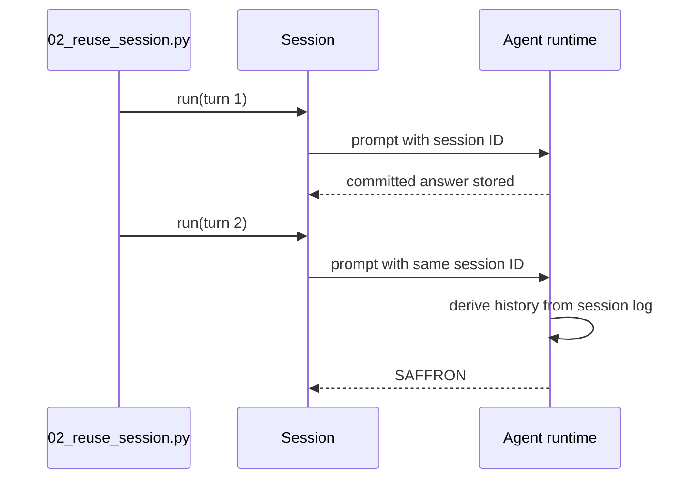

# 教程 02：复用运行时与会话

[English](02-reuse-session.md) | 中文

## 结果

通过 [`02_reuse_session.py`](../02_reuse_session.py)运行两个轮次。第二轮会回忆第一轮引入的数据，证明一个 `DeepSeekHarness` 实例会复用其子进程，而一个 `Session` 会保留对话状态。

## 前置要求

完成[教程 01](01-hello.zh.md)。在同一个会话根目录下重复本教程时，请选择新的会话 ID，因为复用 ID 会恢复持久对话。

## 运行

```sh
uv run python 02_reuse_session.py \
  --session-id python-demo-02 \
  --session-root /tmp/dsh-demo-02
```

第一轮输出 `stored`，第二轮输出 `SAFFRON`。

## 工作原理

`start_session()` 返回绑定到一个会话 ID 的轻量句柄。两次 `Session.run()` 调用共享同一个 `HarnessClient`、运行时进程、会话日志，以及为该 agent 注册的进程内资源。在同一个 harness 中改用另一个会话 ID 会隔离对话历史，但仍然复用进程。



可复用实例与会话句柄位于 [`api.py`](https://github.com/deepseek-ai/deepseek-harness/blob/master/python/sdk/src/deepseek_harness/api.py)。会话历史来自 DSH 持久事件，而不是 Python 侧的消息数组。

## 验证

检查两个精确答案并查看会话根目录。两个轮次必须属于同一个会话标识；运行时只有在第二轮之后才关闭。

## 限制

当前 SDK 不暴露会话列表、读取、fork、删除或显式恢复方法。在所配置的持久化实现支持时，复用 ID 可以恢复持久历史，但应用代码必须拥有自己的会话目录。继续阅读[教程 03](03-stream-events.zh.md)了解实时输出。
