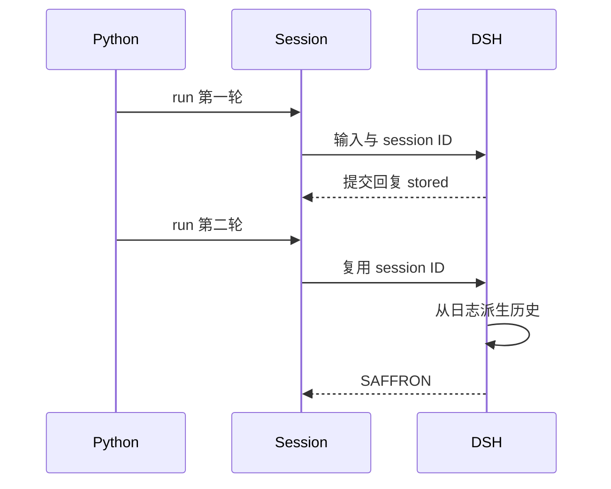

# 教程 02：复用运行时与会话

[English](02-reuse-session.md) | 中文

## 结果

第一轮，让 Agent 记住一串代号；第二轮，只问它刚才的代号是什么。第二条输入没有带答案，所以可以用来检查前一轮的上下文是否仍在。[`02_reuse_session.py`](../02_reuse_session.py)把两次调用放在同一个 `DeepSeekHarness` 中，并复用同一个 `Session`。

## 前置要求

完成[教程 01](01-hello.zh.md)。本章始终在一个存活的 runtime 进程内做两轮调用。重新启动脚本时换一个新的 `--session-id`；保留 Harness home 便于查看日志，不代表此版本 stock SDK 会凭同一个 ID 自动恢复历史。

## 运行

以下命令从 `tutorials/python-sdk` 目录执行；`../../.env` 是仓库根目录的本地凭据文件。若已在 shell 中导出凭据，可省略 env-file；例如 `uv run python 02_reuse_session.py` 会使用脚本默认参数。

```sh
uv run --env-file ../../.env python 02_reuse_session.py \
  --session-id python-demo-02 \
  --dsh-home /tmp/dsh-demo-02
```

脚本要求第一轮只输出 `stored`，第二轮只输出 `SAFFRON`，并检查两轮都为 `completed`。下面省略会话 ID，展示你要核对的输出字段：

```text
turn_1: stored
turn_2: SAFFRON
turn_2_finish_reason: completed
```

如果第二轮答成“代号是 SAFFRON”，脚本仍会失败。这里检查的是精确的代号回忆，不能用“回答里包含这个词”代替。

## 工作原理

源码里要分开看两个动作：`DeepSeekHarness` 拥有 runtime 进程，`start_session()` 返回绑定到会话 ID 的轻量句柄。两次 `session.run()` 共享进程，也使用同一份会话历史。

如果在同一个 harness 中换一个 session ID，进程仍可复用，但对话历史分开了。这就是“少启动一个进程”和“让模型记得前文”的区别；前者是资源管理，后者由会话选择决定。


```mermaid
sequenceDiagram
    participant App as Python
    participant SDK as Session
    participant Runtime as DSH
    App->>SDK: run 第一轮
    SDK->>Runtime: 输入与 session ID
    Runtime-->>SDK: 提交回复 stored
    App->>SDK: run 第二轮
    SDK->>Runtime: 复用 session ID
    Runtime->>Runtime: 从日志派生历史
    Runtime-->>SDK: SAFFRON
```

可复用实例与会话句柄位于 [`api.py`](https://github.com/deepseek-ai/deepseek-harness/blob/183f08e9c6dde7e36cd2318eaee70b0da08fb35e/python/sdk/src/deepseek_harness/api.py)。会话历史来自 DSH 持久事件，而不是 Python 侧的消息数组。

## 验证

检查两个精确答案并查看所选 Harness home。两个轮次必须属于同一个会话标识；运行时只有在第二轮之后才关闭。

读代码时做一个对照：如果只把第二轮改成在另一个 session ID 上运行，哪一项资源不变，哪一项检查不应再成立？可在自己的脚本副本中试验；保留原例的精确断言，避免把模型碰巧猜中当成历史恢复。跨进程恢复的显式入口见[AG-UI 项目](../../../projects/ag-ui-dsh-runtime/README.md#运行时组成和恢复)。

## 限制

当前 SDK 不暴露会话列表、读取、fork、删除或显式恢复方法。本脚本只证明同一运行进程内的复用。跨进程恢复取决于所选 profile、保留的 home 与会话持久化；这里没有验证。应用代码必须维护自己的会话目录。继续阅读[教程 03](03-stream-events.zh.md)了解已提交消息通知。
