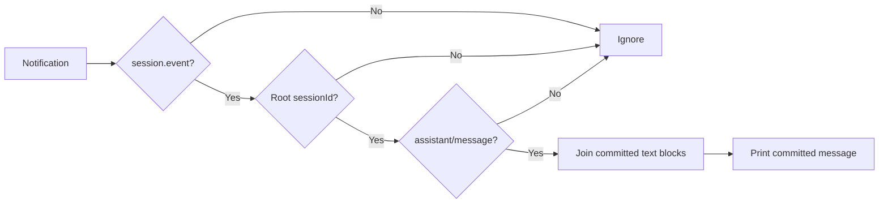

# Tutorial 03: Observe committed assistant messages

English | [中文](03-stream-events.zh.md)

## Outcome

Use [`03_stream_events.py`](../03_stream_events.py) to print a root assistant message when DSH commits it, then compare it with the synchronous `RunResult` returned at idle. The filename is retained for links; this release does not expose token-level assistant chunks.

## Prerequisites

Complete [Tutorial 02](02-reuse-session.md) and install the locked `0.1.5rc1` SDK from the [index](../README.md). The script creates a fresh temporary home and workspace unless you select them explicitly.

## Run it

```sh
uv run python 03_stream_events.py \
  --session-id python-demo-03 \
  --dsh-home /tmp/dsh-demo-03 \
  "Explain agent runtimes in three short bullets."
```

`committed_message` appears when its event arrives; `final_response`, `finish_reason`, and counts follow after idle. The two texts must match for this single-message example.

## How it works

`Session.run()` calls `on_notification` with notifications from the root session and known descendants. `committed_text_from()` accepts only root `session.event` notifications containing `assistant/message`, then joins their text content blocks. It ignores tool events and child messages. Notification delivery can precede the final `RunResult`, but it is not model token streaming.



The release implementation is [`Session.run()`](https://github.com/deepseek-ai/deepseek-harness/blob/183f08e9c6dde7e36cd2318eaee70b0da08fb35e/python/sdk/src/deepseek_harness/api.py); the callback and transport subscription run through [`client.py`](https://github.com/deepseek-ai/deepseek-harness/blob/183f08e9c6dde7e36cd2318eaee70b0da08fb35e/python/sdk/src/deepseek_harness/client.py).

## Verify it

Check exit status 0, at least one committed message, `finish_reason: completed`, and equality between the last projected text and `final_response`. The script fails if these conditions are not met.

## Limitations

There is no token iterator in this release. ASGI callers must bridge the synchronous callback off their event loop. This example validates only one live process; it does not demonstrate cross-process resume. Continue with [Tutorial 04](04-workspace-agent.md) for external-state verification.
