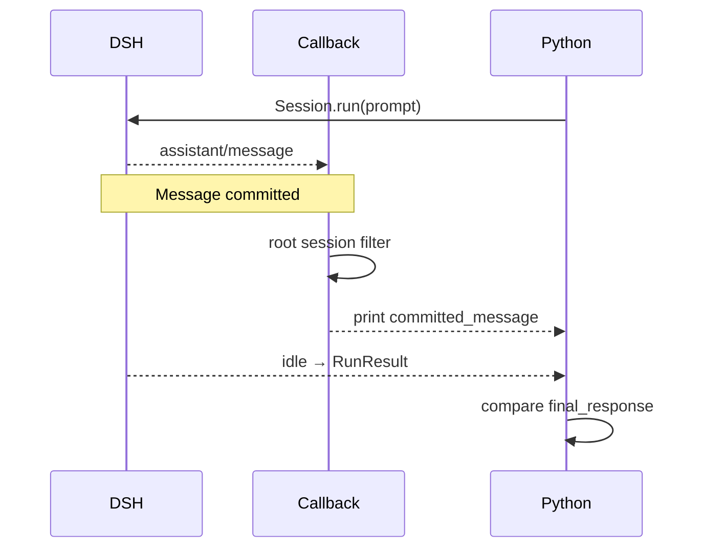

# Tutorial 03: Observe committed assistant messages

English | [中文](03-stream-events.zh.md)

## Outcome

The previous chapter printed its result only after `run()` returned. To observe what the agent has already said while it is still active, use the notification callback in [`03_stream_events.py`](../03_stream_events.py). It can print an assistant message when DSH commits it. You receive a whole committed message, not text appearing one token at a time.

## Prerequisites

Complete [Tutorial 02](02-reuse-session.md) and install the locked `0.1.5rc1` SDK from the [index](../README.md). The script creates a fresh temporary home and workspace unless you select them explicitly.

## Run it

Run the command from `tutorials/python-sdk`; `../../.env` is the local credential file at the repository root. If the credential is already exported in your shell, omit env-file; for example, `uv run python 03_stream_events.py` uses the script’s default arguments.

```sh
uv run --env-file ../../.env python 03_stream_events.py \
  --session-id python-demo-03 \
  --dsh-home /tmp/dsh-demo-03 \
  "Explain agent runtimes in three short bullets."
```

Watch the order in the terminal: `committed_message` is printed inside the callback, while `final_response`, `finish_reason`, and the counts are printed after `run()` returns. The default single-message task should produce matching text; the script compares the last projected message with the final result. The lines may appear almost together—a short task does not guarantee a visible delay.

## How it works

Start reading at the print inside `on_notification()`: it can execute before the synchronous `Session.run()` returns. Then follow the three checks in `committed_text_from()`: is this a `session.event`, does it have the root `sessionId`, and is its type `assistant/message`? Only then are text blocks joined.

Why check the root ID? The SDK can notify you about known descendant sessions too. A child agent’s answer may belong in a timeline, but it should not replace the main agent’s answer. Tool events also need their own presentation.



The release implementation is [`Session.run()`](https://github.com/deepseek-ai/deepseek-harness/blob/183f08e9c6dde7e36cd2318eaee70b0da08fb35e/python/sdk/src/deepseek_harness/api.py); the callback and transport subscription run through [`client.py`](https://github.com/deepseek-ai/deepseek-harness/blob/183f08e9c6dde7e36cd2318eaee70b0da08fb35e/python/sdk/src/deepseek_harness/client.py).

## Verify it

Check exit status 0, at least one committed message, `finish_reason: completed`, and equality between the last projected text and `final_response`. The script fails if these conditions are not met.

Try a keyless exercise: open `test_notification_demo_projects_only_root_committed_message` in `tests/test_demos.py` and inspect the root, child, and unrelated events. Predict which ones yield text, then compare with `uv run pytest -k notification_demo`. This checks projection rules, not what a model will say.

## Limitations

There is no token iterator in this release. ASGI callers must bridge the synchronous callback off their event loop. This example validates only one live process; it does not demonstrate cross-process resume. Continue with [Tutorial 04](04-workspace-agent.md) for external-state verification.
