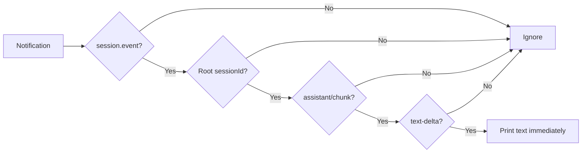

# 教程 03：流式输出已提交的 assistant 文本

[English](03-stream-events.md) | 中文

## 结果

使用 [`03_stream_events.py`](../03_stream_events.py)在 agent 仍在运行时输出文本，理解通知流与空闲时返回的同步 `RunResult` 之间的区别。

## 前置要求

完成[教程 02](02-reuse-session.zh.md)。使用新的会话 ID，避免较早入队或持久化的工作加入当前活动区间。

## 运行

```sh
uv run python 03_stream_events.py \
  --session-id python-demo-03 \
  --session-root /tmp/dsh-demo-03 \
  "Explain agent runtimes in three short bullets."
```

文本会在 `stream:` 之后出现，然后脚本才输出 `finish_reason` 与 `notification_count`。

## 工作原理

`Session.run()` 在其工作线程上为属于根会话树的每条通知调用 `on_notification`。`text_delta_from()` 只接受根会话的 `session.event` 通知，而且事件必须是 `assistant/chunk`，分片必须是 `text-delta`。它有意排除推理、工具调用增量、用量、结束分片和后代文本。



回调分发与活动区间收集位于 [`Session.run()`](https://github.com/deepseek-ai/deepseek-harness/blob/master/python/sdk/src/deepseek_harness/api.py)，传输订阅与读取线程位于 [`client.py`](https://github.com/deepseek-ai/deepseek-harness/blob/master/python/sdk/src/deepseek_harness/client.py)。

## 验证

让模型生成足以拆成多个增量的回复。确认文本先于最终元数据可见，且 `notification_count` 大于零。把 stdout 重定向到文件是检查顺序的简单方法。

## 限制

SDK 没有异步迭代器 API。GUI 或 ASGI 服务器必须在不阻塞事件循环的前提下，把这个同步回调桥接进去。FastAPI 教程会使用线程安全回调与 `asyncio.Queue`。继续阅读[教程 04](04-workspace-agent.zh.md)了解工具与外部状态验证。
