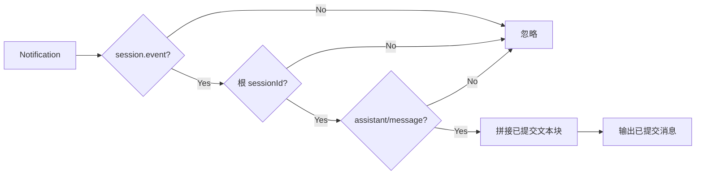

# 教程 03：观察已提交的 assistant 消息

[English](03-stream-events.md) | 中文

## 结果

使用 [`03_stream_events.py`](../03_stream_events.py)在 DSH 提交根会话 assistant 消息时输出文本，再与空闲时返回的同步 `RunResult` 对照。为了保持链接，文件名仍是 stream-events；此版本不提供 assistant 逐 token 分片。

## 前置要求

完成[教程 02](02-reuse-session.zh.md)，并按[索引](../README.zh.md)安装锁定的 `0.1.5rc1` SDK。未显式指定时，脚本为本次运行创建临时 home 与 workspace。

## 运行

```sh
uv run python 03_stream_events.py \
  --session-id python-demo-03 \
  --dsh-home /tmp/dsh-demo-03 \
  "Explain agent runtimes in three short bullets."
```

事件到达时输出 `committed_message`；整个 agent 空闲后输出 `final_response`、`finish_reason` 和计数。本例只有一条消息，两段文本必须一致。

## 工作原理

`Session.run()` 通过 `on_notification` 交付根会话及已知后代的通知。`committed_text_from()` 只接受根会话包含 `assistant/message` 的 `session.event`，并拼接其中的文本块。它忽略工具事件和子会话消息。通知可先于最终 `RunResult` 到达，但它不是模型逐 token 流。


```mermaid
flowchart LR
    N[Notification] --> M{session.event?}
    M -->|No| I[忽略]
    M -->|Yes| S{根 sessionId?}
    S -->|No| I
    S -->|Yes| E{assistant/message?}
    E -->|No| I
    E -->|Yes| P[拼接已提交文本块]
    P --> O[输出已提交消息]
```

发行版实现位于 [`Session.run()`](https://github.com/deepseek-ai/deepseek-harness/blob/183f08e9c6dde7e36cd2318eaee70b0da08fb35e/python/sdk/src/deepseek_harness/api.py)；回调与传输订阅经过 [`client.py`](https://github.com/deepseek-ai/deepseek-harness/blob/183f08e9c6dde7e36cd2318eaee70b0da08fb35e/python/sdk/src/deepseek_harness/client.py)。

## 验证

检查退出码为 0、至少一条已提交消息、`finish_reason: completed`，以及最后一条投影文本与 `final_response` 相同。条件不满足时脚本会失败。

## 限制

此版本没有逐 token 迭代器。ASGI 调用方必须在不阻塞事件循环的前提下桥接同步回调。本例只验证单个运行进程，不演示跨进程恢复。继续阅读[教程 04](04-workspace-agent.zh.md)验证外部状态。
