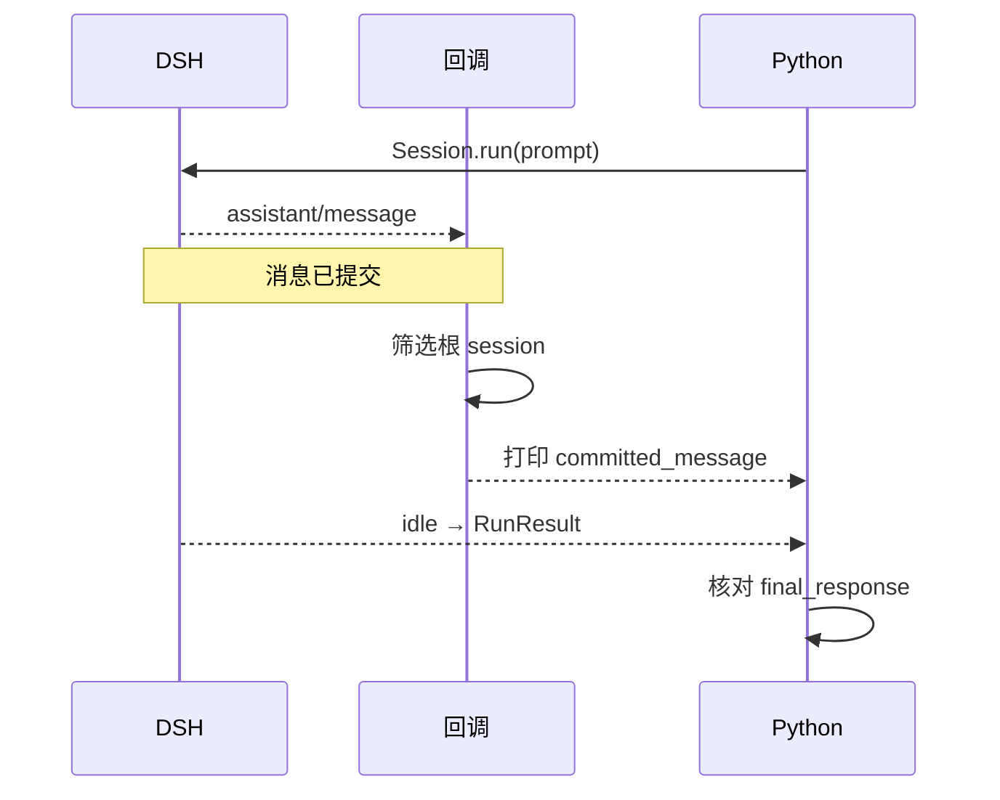

# 教程 03：观察已提交的 assistant 消息

[English](03-stream-events.md) | 中文

## 结果

上一章要等 `run()` 返回后才能打印结果。如果想在运行期间知道 Agent 已经说了什么，可以观察 [`03_stream_events.py`](../03_stream_events.py)中的通知回调：DSH 提交 assistant 消息时，回调就能打印它。这里看到的是整条已提交消息，不是逐 token 冒出的文字。

## 前置要求

完成[教程 02](02-reuse-session.zh.md)，并按[索引](../README.zh.md)安装锁定的 `0.1.5rc1` SDK。未显式指定时，脚本为本次运行创建临时 home 与 workspace。

## 运行

以下命令从 `tutorials/python-sdk` 目录执行；`../../.env` 是仓库根目录的本地凭据文件。若已在 shell 中导出凭据，可省略 env-file；例如 `uv run python 03_stream_events.py` 会使用脚本默认参数。

```sh
uv run --env-file ../../.env python 03_stream_events.py \
  --session-id python-demo-03 \
  --dsh-home /tmp/dsh-demo-03 \
  "Explain agent runtimes in three short bullets."
```

留意终端中的先后顺序：`committed_message` 在回调执行时打印，`final_response`、`finish_reason` 和计数则在 `run()` 返回后打印。默认的单消息任务应使两段文本一致；脚本实际比较的是最后一条投影文本与最终结果。它们紧挨着出现也正常，短任务不保证肉眼可见的时间差。

## 工作原理

阅读 `on_notification()` 时先找打印的位置：它在同步的 `Session.run()` 尚未返回时就可能执行。再看 `committed_text_from()` 的三次筛选：是不是 `session.event`、是不是根 `sessionId`、是不是 `assistant/message`。通过筛选后才拼接文本块。

为什么还要检查根 ID？SDK 可以通知你已知后代 session 的活动。子 Agent 的一句话可以成为时间线内容，却不应覆盖主 Agent 的回答。工具事件同样要另行展示。


```mermaid
sequenceDiagram
    participant R as DSH
    participant C as 回调
    participant A as Python
    A->>R: Session.run(prompt)
    R-->>C: assistant/message
    Note over R,C: 消息已提交
    C->>C: 筛选根 session
    C-->>A: 打印 committed_message
    R-->>A: idle → RunResult
    A->>A: 核对 final_response
```

发行版实现位于 [`Session.run()`](https://github.com/deepseek-ai/deepseek-harness/blob/183f08e9c6dde7e36cd2318eaee70b0da08fb35e/python/sdk/src/deepseek_harness/api.py)；回调与传输订阅经过 [`client.py`](https://github.com/deepseek-ai/deepseek-harness/blob/183f08e9c6dde7e36cd2318eaee70b0da08fb35e/python/sdk/src/deepseek_harness/client.py)。

## 验证

检查退出码为 0、至少一条已提交消息、`finish_reason: completed`，以及最后一条投影文本与 `final_response` 相同。条件不满足时脚本会失败。

做一个无需模型的练习：打开 `tests/test_demos.py` 中的 `test_notification_demo_projects_only_root_committed_message`，逐个看 root、child 和无关事件。先预测哪些能产生文本，再运行 `uv run pytest -k notification_demo` 对照。这个测试检查投影规则，不证明模型会生成某种回复。

## 限制

此版本没有逐 token 迭代器。ASGI 调用方必须在不阻塞事件循环的前提下桥接同步回调。本例只验证单个运行进程，不演示跨进程恢复。继续阅读[教程 04](04-workspace-agent.zh.md)验证外部状态。
