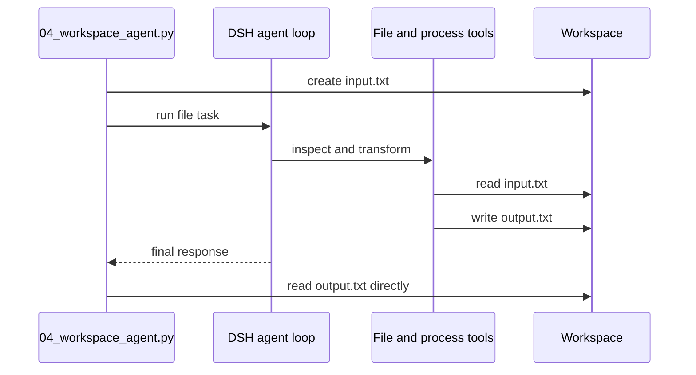

# Tutorial 04: Run tools in a workspace

English | [中文](04-workspace-agent.zh.md)

## Outcome

Use [`04_workspace_agent.py`](../04_workspace_agent.py) to give the agent a real file task. Verify the resulting file directly instead of trusting the model's description of its own work.

## Prerequisites

Complete [Tutorial 03](03-stream-events.md). Use a disposable directory because the bundled agent configuration can expose local filesystem and subprocess tools with the runtime process's permissions.

## Run it

```sh
uv run python 04_workspace_agent.py \
  --workspace /tmp/dsh-demo-04
```

The script creates `input.txt`, asks the agent to sort it into `output.txt`, then reads `output.txt` itself.

## How it works

`cwd` selects the agent workspace and `session_root` keeps logs beside it. The model sees tools registered by the bundled Cordis composition, chooses the necessary calls, and can execute several model steps before the turn ends. The Python caller remains responsible for checking external state after the run.



The `cwd` and environment mapping are constructed by [`DeepSeekHarness.__init__`](https://github.com/deepseek-ai/deepseek-harness/blob/master/python/sdk/src/deepseek_harness/api.py). The actual tool set belongs to the runtime's Cordis configuration, not to the Python SDK.

## Verify it

Confirm `output.txt` exists and contains `blue`, `green`, and `red` in that order. The file content is stronger evidence than the assistant response. Inspect `.dsh-sessions` for the durable tool-call and tool-result events.

## Limitations

The default example composition is not a security sandbox. `cwd` gives the agent a working directory but does not by itself prevent absolute-path access. Production code should combine an isolated checkout or container with an explicit DSH sandbox policy. Continue with [Tutorial 05](05-low-level-client.md) to inspect the protocol lifecycle.
