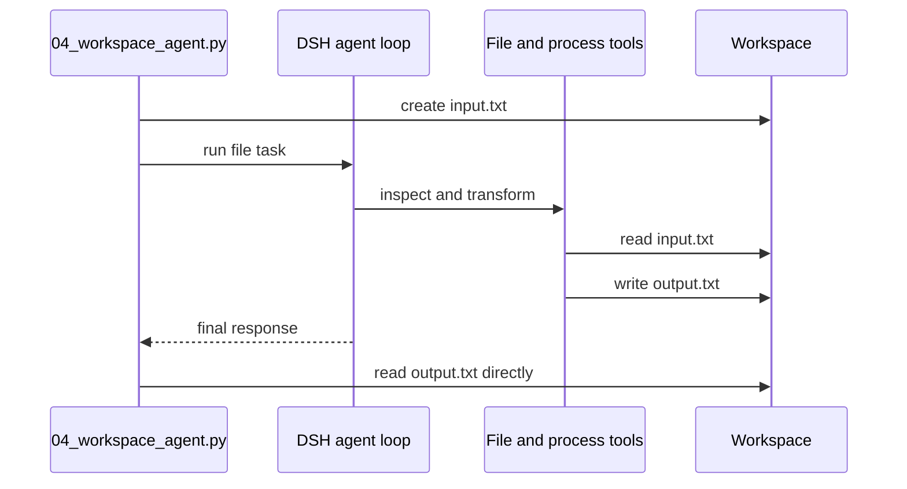

# Tutorial 04: Run tools in a workspace

English | [中文](04-workspace-agent.zh.md)

## Outcome

“The file is sorted” sounds like success, but it is still just a model response. In this chapter, [`04_workspace_agent.py`](../04_workspace_agent.py) asks the agent to sort three lines, then Python reads `output.txt` itself. The file bytes decide whether the task passes.

## Prerequisites

Complete [Tutorial 03](03-stream-events.md). Use a disposable directory because the bundled agent configuration can expose local filesystem and subprocess tools with the runtime process's permissions.

## Run it

Run the command from `tutorials/python-sdk`; `../../.env` is the local credential file at the repository root. If the credential is already exported in your shell, omit env-file; for example, `uv run python 04_workspace_agent.py` uses the script’s default arguments.

```sh
uv run --env-file ../../.env python 04_workspace_agent.py \
  --workspace /tmp/dsh-demo-04
```

The script creates `input.txt`, asks the agent to sort it into `output.txt`, then compares the output with the exact bytes `blue\ngreen\nred\n`. On success it prints `output_verified: exact bytes` and the file contents:

```text
blue
green
red
```

The final newline is part of the check. Having all three colors in the right order is not enough if the bytes differ.

## How it works

Start with `profile="sdk"` in the configuration: this example selects the full profile for file tools. `cwd` selects the working directory; `dsh_home` independently holds profile and session data. The runtime’s Cordis composition registers the actual tools; the Python SDK does not implement them.

Now find `actual = output.read_bytes()`. The caller executes that line independently of the model’s answer. The model may need several requests and tool steps; after the run, we inspect the file state that matters to the application.


```mermaid
sequenceDiagram
    participant App as 04_workspace_agent.py
    participant Agent as DSH agent loop
    participant Tools as File and process tools
    participant Disk as Workspace
    App->>Disk: create input.txt
    App->>Agent: run file task
    Agent->>Tools: inspect and transform
    Tools->>Disk: read input.txt
    Tools->>Disk: write output.txt
    Agent-->>App: final response
    App->>Disk: read output.txt directly
```

The `cwd` and environment mapping are constructed by [`DeepSeekHarness.__init__`](https://github.com/deepseek-ai/deepseek-harness/blob/183f08e9c6dde7e36cd2318eaee70b0da08fb35e/python/sdk/src/deepseek_harness/api.py). The actual tool set belongs to the runtime's Cordis configuration, not to the Python SDK.

## Verify it

The script fails unless the run completes and `output.txt` contains exactly `b"blue\ngreen\nred\n"`. Inspect a retained `--dsh-home` for session events if needed. The default temporary home and workspace are removed only after the runtime closes.

Open the retained `/tmp/dsh-demo-04/output.txt` after the run. Consider the opposite case: the answer says “done,” but the file is absent. Which check decides the outcome? Inspect `finish_reason` and `output_bytes` together to distinguish an incomplete run from an incorrect artifact. When finished, clean up only this experiment’s directory.

## Limitations

The default example composition is not a security sandbox. `cwd` gives the agent a working directory but does not by itself prevent absolute-path access. Production code should combine an isolated checkout or container with an explicit DSH sandbox policy. Continue with [Tutorial 05](05-low-level-client.md) to inspect the protocol lifecycle.
