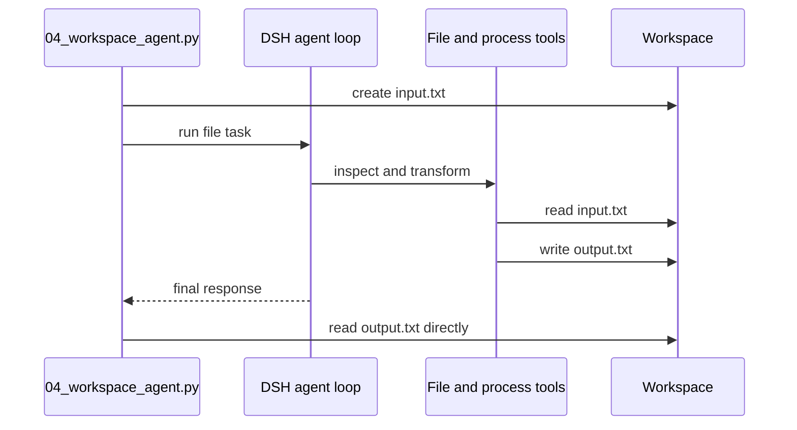

# Tutorial 04: Run tools in a workspace

English | [中文](04-workspace-agent.zh.md)

## Outcome

Use [`04_workspace_agent.py`](../04_workspace_agent.py) to give the agent a real file task. Verify the resulting file directly instead of trusting the model's description of its own work.

## Prerequisites

Complete [Tutorial 03](03-stream-events.md). Use a disposable directory because the bundled agent configuration can expose local filesystem and subprocess tools with the runtime process's permissions.

## Run it

```sh
uv run python 04_workspace_agent.py \
  --workspace /tmp/dsh-demo-04
```

The script creates `input.txt`, asks the agent to sort it into `output.txt`, then compares the output file with the exact bytes `blue\ngreen\nred\n`.

## How it works

`cwd` selects the agent workspace; `dsh_home` independently holds profile and session data. The model sees tools registered by the bundled Cordis composition, chooses the necessary calls, and can execute several model steps before the turn ends. The Python caller remains responsible for checking external state after the run.


```mermaid
sequenceDiagram
    participant App as 04_workspace_agent.py
    participant Agent as DSH agent loop
    participant Tools as File and process tools
    participant Disk as Workspace
    App->>Disk: create input.txt
    App->>Agent: run file task
    Agent->>Tools: inspect and transform
    Tools->>Disk: read input.txt
    Tools->>Disk: write output.txt
    Agent-->>App: final response
    App->>Disk: read output.txt directly
```

The `cwd` and environment mapping are constructed by [`DeepSeekHarness.__init__`](https://github.com/deepseek-ai/deepseek-harness/blob/183f08e9c6dde7e36cd2318eaee70b0da08fb35e/python/sdk/src/deepseek_harness/api.py). The actual tool set belongs to the runtime's Cordis configuration, not to the Python SDK.

## Verify it

The script fails unless the run completes and `output.txt` contains exactly `b"blue\ngreen\nred\n"`. Inspect a retained `--dsh-home` for session events if needed. The default temporary home and workspace are removed only after the runtime closes.

## Limitations

The default example composition is not a security sandbox. `cwd` gives the agent a working directory but does not by itself prevent absolute-path access. Production code should combine an isolated checkout or container with an explicit DSH sandbox policy. Continue with [Tutorial 05](05-low-level-client.md) to inspect the protocol lifecycle.
