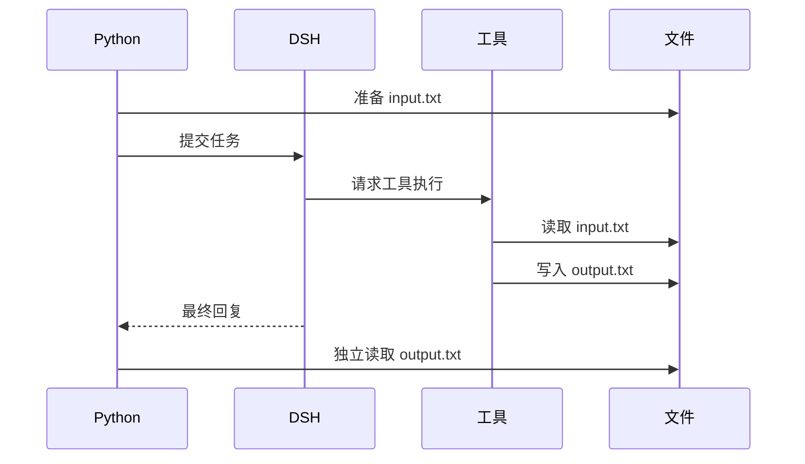

# 教程 04：在 workspace 中运行工具

[English](04-workspace-agent.md) | 中文

## 结果

“已经把文件排好序了”听起来像成功，但那只是模型回复。这一章让 [`04_workspace_agent.py`](../04_workspace_agent.py)把三行文字交给 Agent 排序，然后由 Python 自己读取 `output.txt`。文件字节对了，任务才算通过。

## 前置要求

完成[教程 03](03-stream-events.zh.md)。请使用可丢弃目录，因为内置 agent 配置可以用运行时进程的权限暴露本地文件系统和子进程工具。

## 运行

以下命令从 `tutorials/python-sdk` 目录执行；`../../.env` 是仓库根目录的本地凭据文件。若已在 shell 中导出凭据，可省略 env-file；例如 `uv run python 04_workspace_agent.py` 会使用脚本默认参数。

```sh
uv run --env-file ../../.env python 04_workspace_agent.py \
  --workspace /tmp/dsh-demo-04
```

脚本会创建 `input.txt`，要求 Agent 把排序结果写入 `output.txt`，然后把输出文件与精确字节 `blue\ngreen\nred\n` 比较。成功时会打印 `output_verified: exact bytes` 和文件内容：

```text
blue
green
red
```

最后的换行也在检查范围内。仅仅三种颜色都出现、顺序正确，仍不足以通过精确字节比较。

## 工作原理

先看配置里的 `profile="sdk"`：本例选完整 profile，以便使用文件工具。`cwd` 选择工作目录，`dsh_home` 则独立保存 profile 与会话数据。实际工具由 runtime 的 Cordis 组装注册，Python SDK 不负责实现这些工具。

再跳到 `actual = output.read_bytes()`。这行代码由调用方执行，不依赖模型提供的答案。模型可能经过多个请求和工具步骤才完成任务，我们只在运行结束后检查业务真正关心的文件状态。



[`DeepSeekHarness.__init__`](https://github.com/deepseek-ai/deepseek-harness/blob/183f08e9c6dde7e36cd2318eaee70b0da08fb35e/python/sdk/src/deepseek_harness/api.py)负责构造 `cwd` 和环境映射。实际工具集属于运行时 Cordis 配置，而不属于 Python SDK。

## 验证

只有运行完成且 `output.txt` 恰好包含 `b"blue\ngreen\nred\n"` 时脚本才成功。需要查看会话事件时可保留 `--dsh-home`。默认临时 home 与 workspace 在运行时关闭后才删除。

运行后直接打开保留的 `/tmp/dsh-demo-04/output.txt`。再思考一个反例：如果回答说“完成”而文件不存在，应该看哪条验证结果？排查时把 `finish_reason` 和 `output_bytes` 放在一起看，区分 Agent 没有完成与产物不符合要求。确认不再需要时，只清理本次实验目录。

## 限制

默认示例组装不是安全沙箱。`cwd` 为 agent 提供工作目录，但自身不能阻止绝对路径访问。生产代码应把隔离 checkout 或容器与显式 DSH 沙箱策略组合使用。继续阅读[教程 05](05-low-level-client.zh.md)检查协议生命周期。
