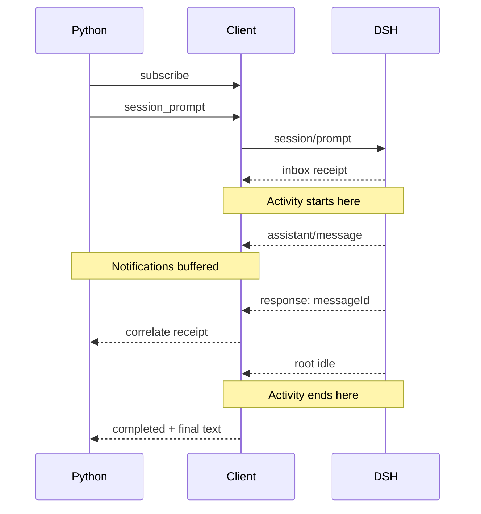

# Tutorial 05: Drive `HarnessClient`

English | [中文](05-low-level-client.zh.md)

## Outcome

A returned HTTP or RPC response often feels like the end of the work. DSH’s `session/prompt` is different: it tells you the input was enqueued, while the model and tools may still be working. [`05_low_level_client.py`](../05_low_level_client.py) opens up `Session.run()` so we can decide which event starts collection and when to take the final answer.

## Prerequisites

Complete [Tutorial 04](04-workspace-agent.md). This tutorial assumes you understand that a JSON-RPC response and an agent result are different events.

## Run it

Run the command from `tutorials/python-sdk`; `../../.env` is the local credential file at the repository root. If the credential is already exported in your shell, omit env-file; for example, `uv run python 05_low_level_client.py` uses the script’s default arguments.

```sh
uv run --env-file ../../.env python 05_low_level_client.py \
  --session-id python-demo-05 \
  --dsh-home /tmp/dsh-demo-05 \
  "Reply with exactly: PYTHON_DEMO_05_OK"
```

The output includes the committed root response, server metadata, the accepted message ID, and the number of observed session events.

## How it works

Find the subscription before `session_prompt()` in the source. The runtime can commit events quickly, even before the RPC response reaches the client. The subscription catches those notifications first. Once the response supplies a `messageId`, `inbox_contains_message()` identifies the durable `agent/inbox/spliced` event that accepted this input.

The activity interval starts at that matching inbox receipt, not at the RPC response. Collect root committed text from there until the next root `session.status=idle`, and check that the interval’s `turn/end` is `completed`. The diagram deliberately places the response later: earlier notifications must be buffered, not discarded because they arrived first.



The public methods are in [`HarnessClient`](https://github.com/deepseek-ai/deepseek-harness/blob/183f08e9c6dde7e36cd2318eaee70b0da08fb35e/python/sdk/src/deepseek_harness/client.py). The high-level implementation in [`Session.run()`](https://github.com/deepseek-ai/deepseek-harness/blob/183f08e9c6dde7e36cd2318eaee70b0da08fb35e/python/sdk/src/deepseek_harness/api.py) applies the same receipt-to-idle rule and then derives `final_response` and `finish_reason`.

## Verify it

Confirm the server identifies itself, `message_id` is non-empty, the committed response is printed with the final counters, and the process exits cleanly. The event count varies by model behavior and configuration; do not assert an exact value in business code.

Reading exercise: which input does `message_id` identify, and what does the JSON-RPC request ID identify instead? The former appears in the inbox event; the transport uses the latter to match one method response. Then inspect the deadline: receiving unrelated notifications continuously must not allow the wait to last forever.

## Limitations

Low-level access exposes transport mechanics but does not add server capabilities. There is no prompt-specific completion result, cancel method, session catalog, approval response, or queue control in the current SDK JSON-RPC method set. Continue with [Tutorial 06](06-raw-jsonrpc.md) to see what the SDK client saves you from implementing.
