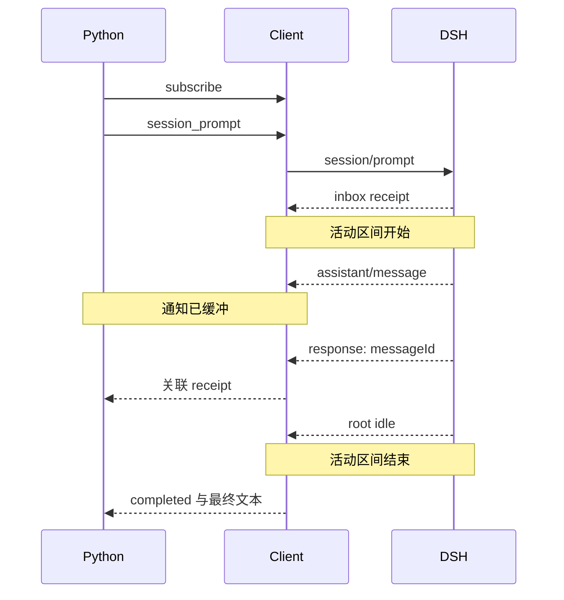

# 教程 05：驱动 `HarnessClient`

[English](05-low-level-client.md) | 中文

## 结果

HTTP 或 RPC 请求返回，通常让人觉得工作结束了。DSH 的 `session/prompt` 不一样：它先告诉你输入已经入队，模型和工具还可能继续工作。[`05_low_level_client.py`](../05_low_level_client.py)拆开高层 `Session.run()`，让我们亲自决定从哪条事件开始收集、等到什么时候才取最终回复。

## 前置要求

完成[教程 04](04-workspace-agent.zh.md)。本教程假设你已经理解 JSON-RPC 响应和 agent 结果是不同事件。

## 运行

以下命令从 `tutorials/python-sdk` 目录执行；`../../.env` 是仓库根目录的本地凭据文件。若已在 shell 中导出凭据，可省略 env-file；例如 `uv run python 05_low_level_client.py` 会使用脚本默认参数。

```sh
uv run --env-file ../../.env python 05_low_level_client.py \
  --session-id python-demo-05 \
  --dsh-home /tmp/dsh-demo-05 \
  "Reply with exactly: PYTHON_DEMO_05_OK"
```

输出包含已提交的根会话回复、服务器元数据、已接受的消息 ID 和观察到的会话事件数量。

## 工作原理

先找到订阅，再找到 `session_prompt()`：代码按这个顺序写，是因为 runtime 可能很快就提交事件，甚至早于 RPC response 到达。订阅先把通知接住；拿到 response 中的 `messageId` 后，`inbox_contains_message()` 才能识别哪条持久 `agent/inbox/spliced` 收下了这次输入。

活动区间从匹配的 inbox receipt 开始，不从 RPC response 开始。此后收集根会话已提交文本，直到下一条根 `session.status=idle`，并检查区间内的 `turn/end` 为 `completed`。图中特意把 response 画晚一点，表示已收到的通知需要缓冲，不能因为它们先到就丢弃。



公开方法位于 [`HarnessClient`](https://github.com/deepseek-ai/deepseek-harness/blob/183f08e9c6dde7e36cd2318eaee70b0da08fb35e/python/sdk/src/deepseek_harness/client.py)。[`Session.run()`](https://github.com/deepseek-ai/deepseek-harness/blob/183f08e9c6dde7e36cd2318eaee70b0da08fb35e/python/sdk/src/deepseek_harness/api.py)的高层实现使用相同的回执到空闲规则，再派生 `final_response` 与 `finish_reason`。

## 验证

确认服务器能标识自身、`message_id` 非空、已提交回复与最终计数器一起输出，而且进程干净退出。事件数量随模型行为和配置而变化；业务代码不应断言精确值。

阅读练习：`message_id` 关联的是哪条输入，JSON-RPC 的 request ID 又关联什么？前者出现在 inbox 事件中，后者由传输层匹配一次方法调用的响应。接着检查代码中的 deadline：即使不断收到无关通知，等待也必须最终超时。

## 限制

低层访问会暴露传输机制，但不会增加服务器能力。当前 SDK JSON-RPC 方法集中没有提示词专属完成结果、取消方法、会话目录、批准响应或队列控制。继续阅读[教程 06](06-raw-jsonrpc.zh.md)，了解 SDK 客户端替你省掉了哪些实现。
