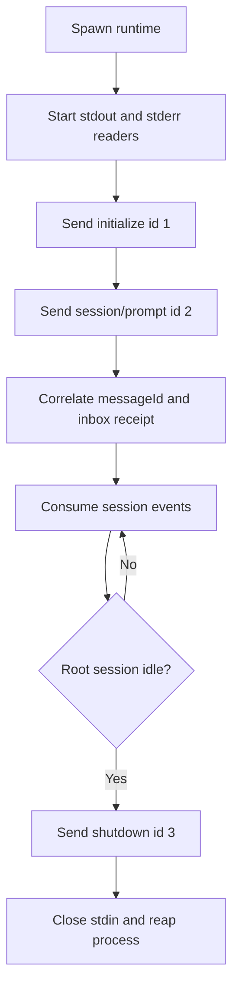

# Tutorial 06: Hand-write stdio JSON-RPC

English | [中文](06-raw-jsonrpc.zh.md)

## Outcome

The previous chapter relied on `HarnessClient`, but how much work did that client save us? [`06_raw_jsonrpc.py`](../06_raw_jsonrpc.py) starts the runtime directly and sends and receives JSON-RPC itself. After running it, you should be able to distinguish protocol semantics from the work needed to communicate reliably with a child process. This is useful for diagnostics or a new language SDK; ordinary applications should use the existing client.

## Prerequisites

Complete [Tutorial 05](05-low-level-client.md). The installed `deepseek-harness-runtime-bin` package must contain a runtime for the current platform.

## Run it

Run the command from `tutorials/python-sdk`; `../../.env` is the local credential file at the repository root. If the credential is already exported in your shell, omit env-file; for example, `uv run python 06_raw_jsonrpc.py` uses the script’s default arguments.

```sh
uv run --env-file ../../.env python 06_raw_jsonrpc.py \
  --session-id python-demo-06 \
  --dsh-home /tmp/dsh-demo-06 \
  "Reply with exactly: PYTHON_DEMO_06_OK"
```

The script prints the prompt message ID and final root committed response, then exits after a successful shutdown response.

## How it works

Start with process launch: the script resolves the published carrier through `deepseek_harness_runtime` and still uses the public `dsh --profile sdk-minimal` entry. We changed the client, not the runtime’s launch rules.

Then read `encode_request()` and the two readers. Each stdout line is a JSON-RPC object. Stderr must be drained concurrently too: a full pipe can stall a child process. The reader does not echo stderr, to avoid printing credentials from diagnostics.

Finally, inspect `PromptProjection`. It treats the RPC response ID and the input messageId separately, retaining receipts and messages that arrive before the response. It settles at the first root idle after the matching receipt, then checks completion and final text. This is the previous chapter’s activity interval, not “read one JSON object and finish.”



Compare this file with [`client.py`](https://github.com/deepseek-ai/deepseek-harness/blob/183f08e9c6dde7e36cd2318eaee70b0da08fb35e/python/sdk/src/deepseek_harness/client.py): the SDK additionally owns concurrent request waiters, filtered subscriptions, descendant discovery, diagnostics, timeout behavior, transport closure errors, and reusable lifecycle management.

Start with a keyless reading exercise: inspect the `encode_request()` test to see how a request becomes one JSON line. Then follow `test_raw_prompt_projection_accepts_receipt_before_response_and_ignores_child`, marking the interval’s start and end in fixture order. Run `uv run pytest -k "raw_jsonrpc or raw_prompt_projection"` to check those rules.

## Verify it

Confirm the prompt ID and committed response, a clean shutdown, and no runtime descendants after exit. A total activity deadline and EOF error prevent indefinite waiting; stderr is drained without echoing possible credentials.

## Limitations

Raw transport bypasses client validation and duplicates difficult lifecycle code. It cannot invoke methods absent from the server. Use it for diagnostics, conformance tests, or implementing a new language SDK; use `DeepSeekHarness` or `HarnessClient` in ordinary business code. The next learning layer is the FastAPI demo, which turns SDK notifications into browser-safe SSE events.
