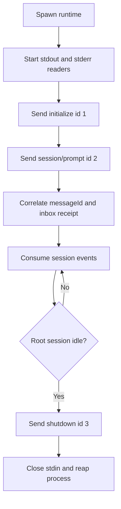

# 教程 06：手写 stdio JSON-RPC

[English](06-raw-jsonrpc.md) | 中文

## 结果

使用 [`06_raw_jsonrpc.py`](../06_raw_jsonrpc.py)在不使用 `DeepSeekHarness` 或 `HarnessClient` 的情况下启动内置运行时。这是协议探针和 SDK 创作示例，不是推荐的应用集成方式。

## 前置要求

完成[教程 05](05-low-level-client.zh.md)。已安装的 `deepseek-harness-runtime-bin` 包必须包含适用于当前平台的运行时。

## 运行

```sh
uv run python 06_raw_jsonrpc.py \
  --session-id python-demo-06 \
  --session-root /tmp/dsh-demo-06 \
  "Reply with exactly: PYTHON_DEMO_06_OK"
```

脚本会输出初始化结果、提示词消息 ID 和实时文本，并在收到成功的关闭响应后退出。

## 工作原理

脚本从 `deepseek_harness_runtime` 解析运行时载体与默认 Cordis 配置，使用管道 stdio 启动进程，并发排空 stdout 与 stderr，每行编码一个紧凑 JSON-RPC 对象，按 ID 关联响应，消费通知，并执行与 SDK 相同的持久回执到空闲活动区间。



把本文件与 [`client.py`](https://github.com/deepseek-ai/deepseek-harness/blob/master/python/sdk/src/deepseek_harness/client.py)比较：SDK 还负责并发请求等待器、过滤订阅、后代发现、诊断、超时行为、传输关闭错误和可复用生命周期管理。

## 验证

确认三个响应 ID 都完成、流式文本存在，而且退出后没有遗留运行时进程。失败信息应包含近期 stderr 诊断，但不能泄露凭据。

## 限制

原始传输会绕过客户端校验，并重复实现困难的生命周期代码。它无法调用服务器不存在的方法。请只把它用于诊断、一致性测试或实现新语言 SDK；普通业务代码应使用 `DeepSeekHarness` 或 `HarnessClient`。下一学习层是 FastAPI demo，它会把 SDK 通知转换为浏览器安全的 SSE 事件。
