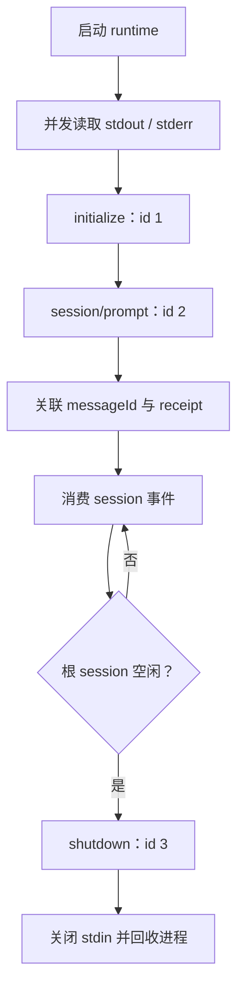

# 教程 06：手写 stdio JSON-RPC

[English](06-raw-jsonrpc.md) | 中文

## 结果

上一章把运行控制交给 `HarnessClient`，但客户端究竟替我们做了多少事？[`06_raw_jsonrpc.py`](../06_raw_jsonrpc.py)这次直接启动 runtime，自己发送和接收 JSON-RPC。跑完后，你应能认出哪些工作属于协议语义，哪些只是为了可靠地读写一个子进程。这适合诊断或实现新语言 SDK；普通业务集成仍应使用现成客户端。

## 前置要求

完成[教程 05](05-low-level-client.zh.md)。已安装的 `deepseek-harness-runtime-bin` 包必须包含适用于当前平台的运行时。

## 运行

以下命令从 `tutorials/python-sdk` 目录执行；`../../.env` 是仓库根目录的本地凭据文件。若已在 shell 中导出凭据，可省略 env-file；例如 `uv run python 06_raw_jsonrpc.py` 会使用脚本默认参数。

```sh
uv run --env-file ../../.env python 06_raw_jsonrpc.py \
  --session-id python-demo-06 \
  --dsh-home /tmp/dsh-demo-06 \
  "Reply with exactly: PYTHON_DEMO_06_OK"
```

脚本输出提示词消息 ID 与根会话已提交的最终回复，在收到成功的关闭响应后退出。

## 工作原理

先看启动部分：脚本从 `deepseek_harness_runtime` 定位已发布载体，仍然通过公开 `dsh --profile sdk-minimal` 启动。改变的是客户端，不是 runtime 的启动规则。

再看 `encode_request()` 和两个 reader。stdout 每行是一个 JSON-RPC 对象；stderr 必须同时读取，否则缓冲区写满也可能让子进程停住。reader 不回显 stderr，避免把诊断中的凭据带到终端。

最后看 `PromptProjection`：它把 RPC 响应 ID 与输入的 messageId 分开处理，并保留 response 之前已到达的 receipt 和消息。等匹配 receipt 之后第一次 root idle，再检查 completed 和最终文本。这是前一章的活动区间规则，不是“读到一个JSON对象就结束”。


```mermaid
flowchart TD
    Spawn[启动 runtime] --> Readers[并发读取 stdout / stderr]
    Readers --> Init[initialize：id 1]
    Init --> Prompt[session/prompt：id 2]
    Prompt --> Receipt[关联 messageId 与 receipt]
    Receipt --> Events[消费 session 事件]
    Events --> Idle{根 session 空闲？}
    Idle -->|否| Events
    Idle -->|是| Shutdown[shutdown：id 3]
    Shutdown --> Reap[关闭 stdin 并回收进程]
```

把本文件与 [`client.py`](https://github.com/deepseek-ai/deepseek-harness/blob/183f08e9c6dde7e36cd2318eaee70b0da08fb35e/python/sdk/src/deepseek_harness/client.py)比较：SDK 还负责并发请求等待器、过滤订阅、后代发现、诊断、超时行为、传输关闭错误和可复用生命周期管理。

可以先做一个无模型的阅读练习：打开 `encode_request()` 的测试，看一条请求如何变成一行 JSON；再看 `test_raw_prompt_projection_accepts_receipt_before_response_and_ignores_child`，按 fixture 的顺序标出区间起止。运行 `uv run pytest -k "raw_jsonrpc or raw_prompt_projection"` 检查这两项规则。

## 验证

确认提示词 ID 和已提交回复、正常关闭，以及退出后没有遗留运行时后代进程。总活动时限与 EOF 错误避免无限等待；stderr 会被排空，但不会回显可能包含凭据的内容。

## 限制

原始传输会绕过客户端校验，并重复实现困难的生命周期代码。它无法调用服务器不存在的方法。请只把它用于诊断、一致性测试或实现新语言 SDK；普通业务代码应使用 `DeepSeekHarness` 或 `HarnessClient`。下一学习层是 FastAPI demo，它会把 SDK 通知转换为浏览器安全的 SSE 事件。
