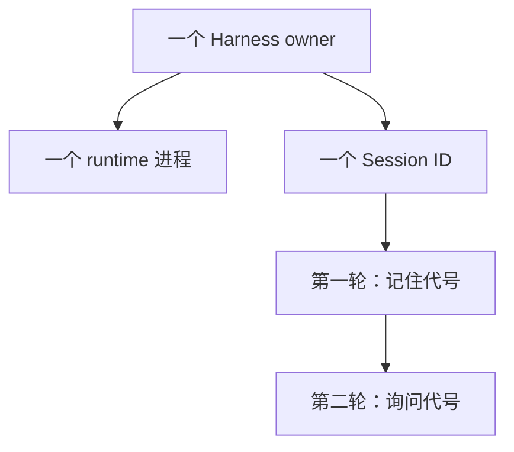
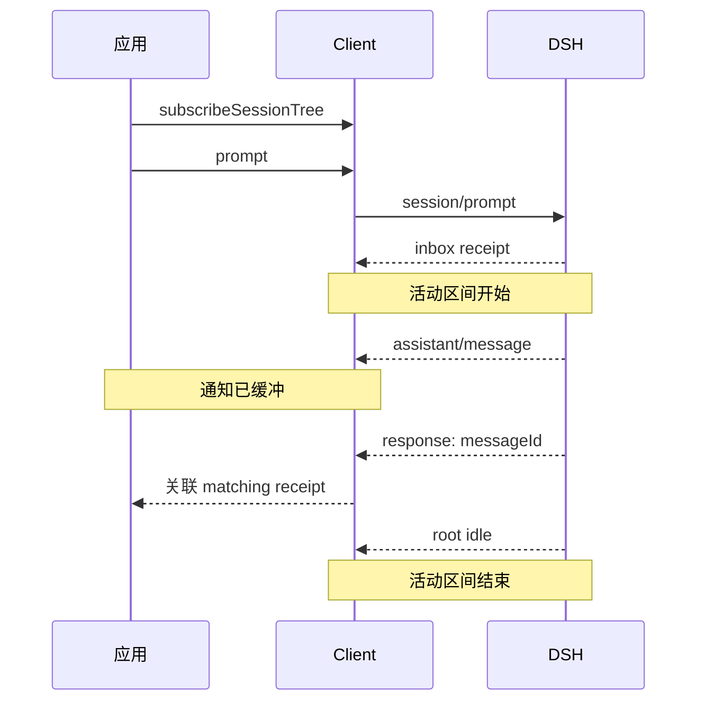

# TypeScript SDK：从公开 profile 到底层 receipt-to-idle

先用 TypeScript 发一句话给 Agent，再让它记住一串代号，最后请它写一个文件。每一步都增加一个可以独立检查的事实：调用完成、会话连续、外部产物正确。第四例再拆开高层 SDK，看看它为什么要同时等待入队回执和 Agent 空闲。

四个完整脚本已经处理运行目录、超时和清理。第一次阅读时不必从 helper 开始：先运行对应示例，看下面的小段核心调用，再沿链接追到你刚刚观察的行为。文中的输出片段是字段示意，带日期的真实验收单独保留在末尾。

## 版本与前置条件

- npm SDK/runtime：精确锁定 `0.1.7-rc.2`，上游 tag `dsh-v0.1.7-rc.2`，commit `477b4f420553e8a52c2fbccc464d7561b239c443`。
- Node：`^22.19.0 || >=24.0.0`；pnpm：`12.3.4`。项目使用 strict ESM/NodeNext，`node --import tsx` 运行 TypeScript。
- 需要可用的 `DEEPSEEK_API_KEY`。可选 `DEEPSEEK_BASE_URL` 必须兼容这个发行版的 Messages 请求。先从仓库根目录执行下面的安装命令；进入 `tutorials/typescript-sdk` 后，后续命令都留在这个目录执行，并通过仓库根目录被忽略的 `.env` 向父进程提供凭据。

```sh
cd tutorials/typescript-sdk
pnpm install --frozen-lockfile
pnpm test
pnpm typecheck
pnpm lint
pnpm format:check
```

发布版 SDK 的默认 resolver 从同版本 `@deepseek-ai/dsh` 包定位 CLI，所以不需要把机器上的源码路径填进示例。[`src/runtime-launch.ts`](src/runtime-launch.ts)选择公开 `profile: "sdk-minimal"`，为每次运行创建 `.runtime/<example>-<random>/workspace`、独立 `dshHome` 和临时 HOME，并以 `processCwd` 选择进程工作目录。子进程环境只保留必要的路径、locale、证书和 DeepSeek 凭据。示例固定 provider 为 `deepseek-official`、model 为 `deepseek-flash`；不要把 Python 教程的模型默认值套过来。

四例都有 `--help`、`--prompt`、`--session` 和 `--deadline-ms`，可用 `--patch <绝对路径>` 追加 profile patch。示例 02 另有 `--second-prompt` 与 `--nonce`。先使用默认参数，读清行为后再逐项改动；profile 始终是 `sdk-minimal`。

`sdk-minimal` 配置允许 Agent 使用工具并具有 `danger-full-access` 执行策略。临时 workspace 和 home 用于确定示例产物的位置，并不限制进程读取或修改其他路径。真实模型运行应放在可丢弃的开发环境。

## 1. 显式启动高层 SDK

```sh
node --env-file=../../.env --import tsx examples/01_explicit_launch.ts
```

打开 [`examples/01_explicit_launch.ts`](examples/01_explicit_launch.ts)，核心动作是下面三行。这里摘出业务调用；完整脚本在外层保留 deadline、`finally` 和清理逻辑：

```ts
const result = await owner.run(prompt, { sessionId });
requireCompletedTurn(result.events);
const answer = result.finalResponse;
```

`DeepSeekHarness` 在第一次使用时启动同版本 runtime 并完成 initialize。Promise resolve 只说明 SDK 已经取得结果，模型也可能因为错误或 token 上限停下来，所以随后仍要检查最后一个 `turn/end.reason.kind` 为 `completed`。这个检查位于 [`src/run-outcome.ts`](src/run-outcome.ts)。

成功结果中的关键字段形如下面这样，示意省略了随执行变化的 `eventCount`：

```json
{"result":{"sessionId":"typescript-explicit-launch","finalResponse":"TypeScript SDK 已连接。"}}
```

再运行一次，加上 `--prompt "只回复 TS_SECOND_OK，不调用工具。"`。检查回答内容，再到代码里找是谁关闭 runtime。改变提示词不应改变进程所有权；`finally` 中的 `close()` 成功之后，才删除本次状态目录。

## 2. 复用 runtime 和 session

```sh
node --env-file=../../.env --import tsx examples/02_reuse_session.ts
```

[`examples/02_reuse_session.ts`](examples/02_reuse_session.ts)先让 Agent 记住 `amber`，再只问“刚才的代号是什么”。第二条输入没有答案，所以第二轮的回答才有检查上下文的价值。核心关系是一个 owner、一份 Session、两次调用：

```ts
const session = owner.session("typescript-reused-session");
const first = await session.run("记住代号 amber，只用文字确认。");
const second = await session.run("刚才的代号是什么？只回答代号原文。");
```

完整脚本对每轮单独施加 deadline，并检查 `completed`。第二轮回复去除首尾空白并经 Unicode NFKC 规范化后，必须与代号完全相等；`chamber` 或 `memory: amber` 都不通过。输出中的 `sameRuntimeOwner: true` 描述代码复用关系，`turns[1]` 才是模型回忆的检查对象。



试着加 `--nonce SAFFRON`：默认第一轮会改为记住 `SAFFRON`，第二轮仍只问代号。若自定义 `--prompt` 或 `--second-prompt` 改变答案，应同时传匹配的 `--nonce`，且不要在第二轮问题中泄漏答案。这个例子验证同一个存活进程内的复用，不演示重启后恢复 session。

## 3. 通知投影与外部产物

```sh
node --env-file=../../.env --import tsx examples/03_notification_stream.ts
```

这次 [`examples/03_notification_stream.ts`](examples/03_notification_stream.ts)让 Agent 写文件，同时把通知交给应用投影。先看这段连接代码，再读 [`src/notification-projection.ts`](src/notification-projection.ts)：

```ts
const projection = new NotificationProjection(sessionId);
const result = await owner.run(prompt, {
  sessionId,
  onNotification: (notification) => projection.accept(notification),
});
```

`onNotification` 在运行期间接收 session tree 通知；本脚本最后统一输出投影 snapshot，并不在终端逐条滚动事件。`NotificationProjection` 只用 root session 已提交的 `assistant/message` 更新 `rootText`，child 和 foreign session 的文本不会替换主回答。它还统计 root 工具事件、subagent 及运行状态。

这里的“通知”也不等于 token 流。本版 SDK server 不下发实时 `agent/assistant-stream`；模型可能先生成一段文字，提交整条消息后，客户端才收到 `assistant/message`。

接下来在脚本中找 `readFile(proofPath)`。这一步由 Node 自己读取 `dsh-typescript-proof.txt`，与 `hands-on-dsh TypeScript SDK proof\n` 的 34 个 UTF-8 字节比较。模型说“已创建”只是回答，不能代替这个检查。通过时，输出里的产物部分是：

```json
{"proof":{"verified":true,"byteLength":34}}
```

关闭 runtime 成功后，脚本删除自己创建的状态目录，因此请把文件校验结果和投影输出一起看。想练习过滤逻辑，无需再花一次模型调用：读 `tests/run-semantics.test.ts` 中 root/child/foreign 的 fixture，先预测 `rootText` 应保留哪条消息，再用 `pnpm exec vitest run tests/run-semantics.test.ts` 核对。

## 4. 底层 HarnessClient

```sh
node --env-file=../../.env --import tsx examples/04_low_level_client.ts
```

前三例由高层 API 等待完成；现在读 [`examples/04_low_level_client.ts`](examples/04_low_level_client.ts)，它显式执行 `start()` 和 `initialize()`，再把通知消费交给 [`src/low-level-run.ts`](src/low-level-run.ts)。关键顺序是先 `subscribeSessionTree()`，后 `prompt()`：

```ts
const subscription = client.subscribeSessionTree(sessionId);
const messageId = await client.prompt(sessionId, [{ type: "text", text: input }]);
```

`prompt()` 返回的 message ID 用于寻找持久 inbox receipt；方法返回不代表完整 turn 结束。通知可能比 response 更早抵达，订阅先把它们缓冲下来。下面画一种允许发生的顺序，而不是每次都必须复现的顺序：



底层循环忽略 matching receipt 之前的通知，只从 receipt 后收集 root `assistant/message`。到下一次 root `idle` 时，检查区间中的最后一个 `turn/end` 为 `completed`，再返回最终文本。child 和 foreign 消息不充当 root 回答；异常 EOF 会让订阅拒绝，不能把断开当作成功结束。

输出中的 `serverInfo` 确认连接对象，`receipt` 是输入 message ID，`finalResponse` 才是答案。读测试里的“receipt先于response”场景，找出是哪一层保存了早到通知；然后想一想，如果订阅放到 `prompt()` 之后，会失去哪段观察。

四例都用 [`src/owner-deadline.ts`](src/owner-deadline.ts)为活动等待设置 deadline，示例 02 的两轮分别计时。一个 JSON-RPC request timeout 只管一次方法请求，不能覆盖后续等 receipt 和 idle 的全部时间；到期时关闭拥有进程的 harness/client。清理必须等 SDK close 确认，关闭失败就保留状态目录供排查。关闭整个自有 runtime 也不等同于服务器提供了单 session 的 wire cancel。

## Keyless 测试与真实观察

`tests/fixtures/fake-runtime.mjs` 是显式传给公开 `dshBin` 选项的测试 CLI，要求规范的 `--profile sdk-minimal` 参数；应用示例使用默认同版本 resolver。测试验证 profile 选项、替换环境、ownership cleanup、两轮记忆、matching receipt 前后顺序、root/child/foreign 过滤、精确工具字节、EOF、协议错误、deadline 和强制回收。fixture 生成已提交的消息事件；它不模拟未下发的实时流。

2026-09-28 在 Node 26.7.0、pnpm 12.3.4、macOS arm64 上，`pnpm test`、`pnpm typecheck`、`pnpm lint`、`pnpm format:check` 与四个真实入口分别执行。真实结果：示例 01 收到“TypeScript SDK 已连接。”；示例 02 的两轮回复包含 `amber`；示例 03 记录 1 次 tool call/result、精确 34 字节 proof；示例 04 收到 runtime identity 和 matching receipt，在 root idle 后得到最终回答。外部进程采样分别运行四例，捕获后代 PID 数量为 2、2、12、2；各父进程退出后对应 PID 均不存在，且示例 03 的 proof 验证成功。这些是正常关闭的观察，不扩展为任意异常情况下所有后代都会退出的保证。

## 源码与限制

固定版本的[公开 launch resolver](https://github.com/deepseek-ai/deepseek-harness/blob/477b4f420553e8a52c2fbccc464d7561b239c443/packages/sdk/client/src/launch.ts)、[高层 API](https://github.com/deepseek-ai/deepseek-harness/blob/477b4f420553e8a52c2fbccc464d7561b239c443/packages/sdk/client/src/api.ts)、[底层 client](https://github.com/deepseek-ai/deepseek-harness/blob/477b4f420553e8a52c2fbccc464d7561b239c443/packages/sdk/client/src/client.ts)和[server 通知转发](https://github.com/deepseek-ai/deepseek-harness/blob/477b4f420553e8a52c2fbccc464d7561b239c443/packages/sdk/server/src/server.ts)是本教程的源码依据。旧版行为与日期分开的记录见[迁移审查](../../docs/reviews/2026-09-28-upstream-refresh.md)。

这是单进程学习示例，不提供多租户隔离、进程池、持久任务编排或 wire 级取消。生产应用需要把业务 Run/Task 的状态与 DSH Session/Turn 分开，并决定超时后的副作用核对与重试策略。下一步可读[Runtime Supervision 实验](../../labs/runtime-supervision/README.md)，再比较[Python 与 TypeScript SDK](../../docs/comparisons/python-vs-typescript-sdk.md)。
